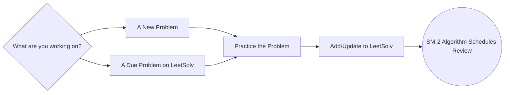
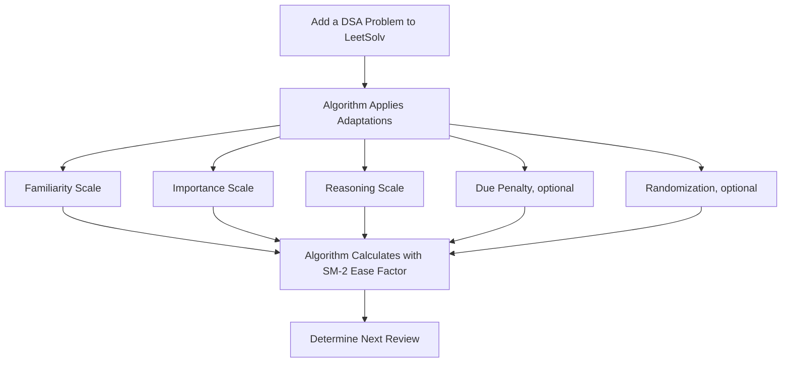
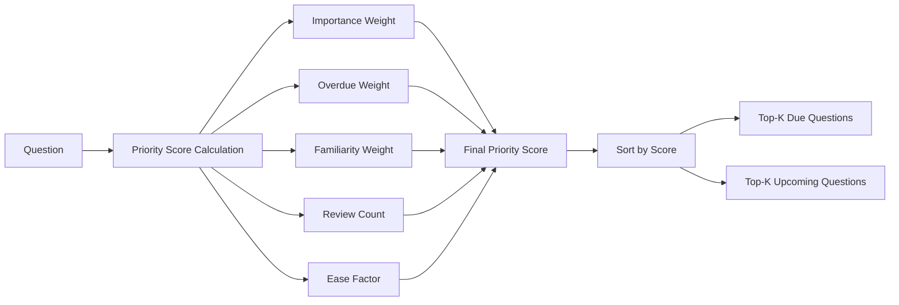
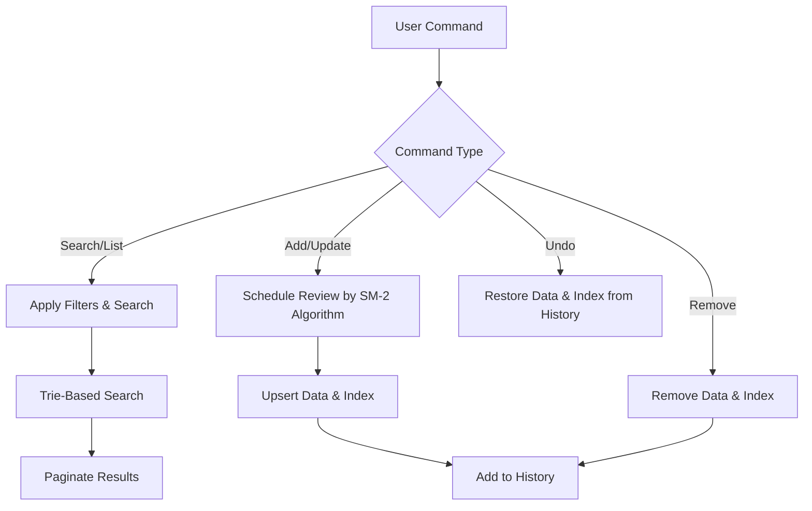

[English](./README.md) | [繁體中文](./README.zh-TW.md) | [简体中文](./README.zh-CN.md)


# LeetSolv
[](https://github.com/eannchen/leetsolv/releases)
[](https://goreportcard.com/report/github.com/eannchen/leetsolv)
[](https://github.com/eannchen/leetsolv/actions/workflows/ci.yml)

**LeetSolv** is a CLI tool for **Data Structures and Algorithms (DSA)** problem revision with **spaced repetition**. It's powered by a customized [SuperMemo 2](https://en.wikipedia.org/wiki/SuperMemo) algorithm that incorporates variables such as **familiarity**, **importance**, and **reasoning**. This approach moves beyond rote memorization, helping you to master complex algorithms through **deliberate practice**.

*Curious how this compares to tools like Anki? See the [FAQ](#faq).*

> ***0️⃣ Zero Dependencies Philosophy**: Implemented entirely in pure Go with no third-party libraries, APIs, or external tools. Even some standard packages are avoided to give full control over the underlying implementations—highlighting the project’s focus on fundamentals. For more details, see [MOTIVATION.md](document/MOTIVATION.md)*.

**The LeetSolv Workflow:**

This diagram illustrates the recommended daily workflow for using LeetSolv effectively.




## Table of Contents
- [LeetSolv](#leetsolv)
  - [Table of Contents](#table-of-contents)
  - [Quick Installation](#quick-installation)
    - [Homebrew (macOS/Linux)](#homebrew-macoslinux)
    - [Installation Script (macOS/Linux)](#installation-script-macoslinux)
    - [Manual Download (All Platforms)](#manual-download-all-platforms)
    - [Verify Installation](#verify-installation)
  - [Review Scheduling System](#review-scheduling-system)
    - [Adaptive SM-2 Algorithm](#adaptive-sm-2-algorithm)
    - [Due Priority Scoring](#due-priority-scoring)
    - [Interval Growing Curve](#interval-growing-curve)
  - [Problem Management](#problem-management)
    - [Core Functionalities](#core-functionalities)
    - [Data Privacy \& Safety](#data-privacy--safety)
    - [CLI Interface](#cli-interface)
  - [Usage](#usage)
  - [Configuration](#configuration)
  - [Support](#support)
    - [FAQ](#faq)
      - [Q: Why use LeetSolv instead of an Anki deck?](#q-why-use-leetsolv-instead-of-an-anki-deck)
      - [Q: Should I add all my previously solved problems?](#q-should-i-add-all-my-previously-solved-problems)
      - [Q: After a period of use, I accumulated too many due problems.](#q-after-a-period-of-use-i-accumulated-too-many-due-problems)
    - [Documentation](#documentation)
  - [Roadmap](#roadmap)
    - [Installation \& Execution](#installation--execution)
    - [Functionality](#functionality)

## Quick Installation

### Homebrew (macOS/Linux)

```bash
brew tap eannchen/tap
brew install leetsolv
```

### Installation Script (macOS/Linux)

Download and run the installation script
```bash
curl -fsSL https://raw.githubusercontent.com/eannchen/leetsolv/main/install.sh | bash
```

### Manual Download (All Platforms)
1. Go to [Releases](https://github.com/eannchen/leetsolv/releases)
2. Download the binary for your platform:
   - **Linux**: `leetsolv-linux-amd64` or `leetsolv-linux-arm64`
   - **macOS**: `leetsolv-darwin-amd64` or `leetsolv-darwin-arm64`
   - **Windows**: `leetsolv-windows-amd64.exe` or `leetsolv-windows-arm64.exe`

> - *For detailed installation instructions, see [INSTALL.md](document/INSTALL.md)*
> - *Future Windows automated installation support is [planned](#roadmap).*

### Verify Installation
```bash
leetsolv version
leetsolv help
```

## Review Scheduling System

### Adaptive SM-2 Algorithm

When a problem is added, LeetSolv applies the SM-2 algorithm with custom factors—**familiarity (5 levels)**, **importance (4 levels)**, and **reasoning (3 levels)**— to calculate the next review date. And a **randomization** is applied to avoid bunching reviews into the same days. This design reinforces the goal of mastering data structures and algorithms and **avoids rote recall**.




> *Check here to learn more about the algorithm: [Interval Growth Curve](#interval-growing-curve)*


### Due Priority Scoring
With SM-2, due reviews can easily accumulate since users have varying schedules and study habits. To address this challenge, LeetSolv introduces a due priority scoring feature that **allows users to prioritize due questions based on the priority score**.



> *By default, the priority score is calculated using the following formula: (1.5×Importance)+(0.5×Overdue Days)+(3.0×Familiarity)+(-1.5×Review Count)+(-1.0×Ease Factor)*

**Due priority list demo:**


### Interval Growing Curve

This system helps you prioritize problems and manage your review schedule efficiently, even with limited study time.

Your **review intervals** are automatically set based on a problem's **importance**. This interval then expands over time based on your **familiarity** and **reasoning** level with the problem.

This means you can:

- **Build a strong foundation**: Prioritize *NeetCode Blind 75* or *NeetCode 150* to build a foundation, and use *NeetCode 250* for extra practice.
- **Target specific goals**: Prioritize problems from company-specific lists for upcoming interviews.

**Critical problems are reviewed more often, while less important ones get longer intervals.**

The following graphs demonstrate how review intervals grow over time for different importance levels, showing the default growth pattern:


**Critical Problems**: Shortest intervals with frequent reviews to ensure mastery of the most important concepts.


**High Importance**: Moderate intervals balance frequency for important problems.


**Medium Importance**: Standard intervals for regular practice.


**Low Importance**: Longer intervals for problems that require less frequent review.

> *[Future iterations](#roadmap) may enable the modification of algorithm parameters directly within the configuration file.*


## Problem Management

### Core Functionalities

- **CRUD + Undo**: Easily **create**, **view**, **update**, and **delete** your problems. You can also **undo** your last action.
- **Trie-Based Search**: Instantly find problems with **blazing-fast search and filtering** by keyword, importance, familiarity, and more.
- **Quick Views**: Get a **summary** of all your problems, including those that are due soon, or view a full **paginated list**.



**Search, History, Delete, Undo functionality demo:**


### Data Privacy & Safety

- **No Data Collection**: LeetSolv does not upload user data to the internet.
- **Atomic Writes**: All updates use temporary files with atomic replacement to **guarantee consistency** and **prevent data loss**.


### CLI Interface
- **Interactive & Batch Modes**: Work in a **turn-based interactive mode** or run **direct commands** for quick actions.
- **Intuitive Commands**: Use familiar aliases like `ls`, `rm`, and get **color-coded output** for a clear and pleasant experience.

**Pagination demo:**


## Usage

LeetSolv can be run interactively or by passing commands directly from your terminal.

```bash
# Start interactive mode
leetsolv

# Or run commands directly
leetsolv add https://leetcode.com/problems/two-sum
leetsolv status

# Get help
leetsolv help
```

[View Full Usage Guide (USAGE.md)](document/USAGE.md)

## Configuration

LeetSolv can be customized using environment variables or a JSON settings file. This allows you to change file paths, algorithm parameters, and scoring weights.

For a complete list of all available options, default values, and examples, please see the detailed configuration guide:

[View Full Configuration Guide (CONFIGURATION.md)](document/CONFIGURATION.md)

## Support

### FAQ

#### Q: Why use LeetSolv instead of an Anki deck?

A: Anki is excellent for **memorizing facts** that take seconds, **but for DSA, it can be counterproductive**. LeetSolv's custom SM-2 algorithm **spaces out** the review interval and uses your input on **reasoning**, **familiarity**, and a problem's **importance** to create a schedule that deepens your problem-solving ability—not just check if you memorized the answer.

👉 Tip: Use Anki for memorizing facts, but use LeetSolv to schedule deep, deliberate problem-solving sessions.

#### Q: Should I add all my previously solved problems?

A: **No.** LeetSolv is not a solved-problem database — it’s a spaced repetition scheduler.
Only add problems you actually want to revisit. The scheduling algorithm relies on the date you add a problem to calculate reviews, so bulk-adding will create an unrealistic schedule and an overwhelming pile of due problems.

👉 Tip: If you want to review an old problem you solved months ago, just re-solve it first, then add it to LeetSolv on that day. This way the "last seen" date is accurate.

#### Q: After a period of use, I accumulated too many due problems.

A: This is the **nature** of the SM-2 algorithm — if you skip days or add many problems at once, the due list can grow quickly.
To make this manageable, LeetSolv introduces **[Due Priority Scoring](#due-priority-scoring)**, which ranks due problems by importance, familiarity, overdue days, review count, and ease factor.
Instead of clearing everything at once, just focus on the **highest-priority problems** first. The rest can safely wait until later.

👉 Tip: Once you’ve mastered a problem and re-solved it a few times, you can safely remove it from LeetSolv. The goal isn’t to track everything forever, but to focus on problems that still need spaced practice.


### Documentation
- **[INSTALL.md](document/INSTALL.md)**: Complete installation guide with troubleshooting
- **[USAGE.md](document/USAGE.md)**: Command-line usage guide
- **[CONFIGURATION.md](document/CONFIGURATION.md)**: Configuration options and environment variables
- **[MOTIVATION.md](document/MOTIVATION.md)**: Project motivation and design notes
- **This README**: Project overview and quick start

## Roadmap

Our roadmap is guided by our goal to make LeetSolv a powerful tool for deliberate practice. Have a suggestion? Feel free to [open an issue](https://github.com/eannchen/leetsolv/issues)!

### Installation & Execution

- Support Windows automated installation

### Functionality

- Provide tagging functionality
- Support other DSA practice platforms

---

**LeetSolv** - A spaced repetition CLI for DSA, powered by a custom SM-2 algorithm for deliberate practice.