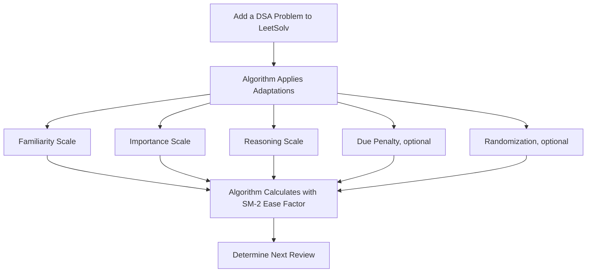
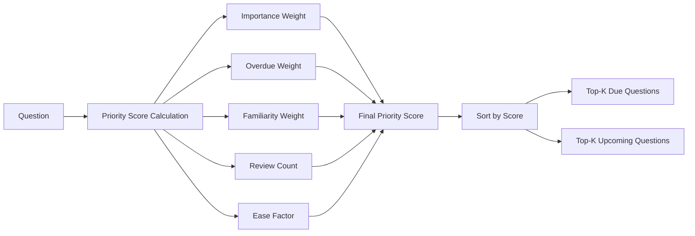
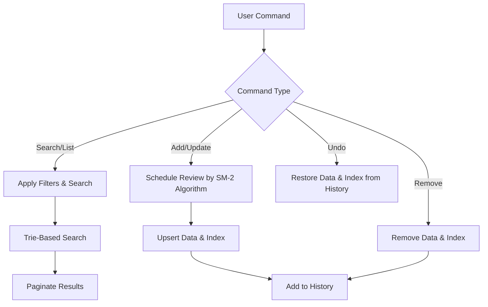

# LeetSolv

LeetSolv is a command-line revision tool that utilizes a custom-adapted [SuperMemo 2](https://en.wikipedia.org/wiki/SuperMemo) algorithm. This algorithm incorporates variables for familiarity, importance, reasoning, and additional factors, designed to facilitate the mastery of algorithms through practice—**not rote memorization**.

**0️⃣ Zero Dependencies Philosophy**: Implemented entirely in pure Go with no third-party libraries, APIs, or external tools. Even some standard packages are avoided to give full control over the underlying implementations—highlighting the project’s focus on fundamentals. *For more details, see [MOTIVATION.md](document/MOTIVATION.md)*.


## Table of Contents
- [LeetSolv](#leetsolv)
  - [Table of Contents](#table-of-contents)
  - [Quick Installation](#quick-installation)
    - [Automated Install (Linux/macOS)](#automated-install-linuxmacos)
    - [Manual Download (All Platforms)](#manual-download-all-platforms)
    - [Verify Installation](#verify-installation)
  - [Review Scheduling Engine](#review-scheduling-engine)
    - [Adaptive SM-2 Algorithm](#adaptive-sm-2-algorithm)
    - [Due Priority Scoring](#due-priority-scoring)
    - [Interval Growth Strategy](#interval-growth-strategy)
  - [Problem Management](#problem-management)
    - [CRUD + undo](#crud--undo)
    - [Data Privacy \& Safety](#data-privacy--safety)
    - [CLI Interface](#cli-interface)
  - [Usage](#usage)
    - [Interactive Mode](#interactive-mode)
    - [Command Line Mode](#command-line-mode)
    - [Available Commands](#available-commands)
  - [Configuration](#configuration)
    - [File Paths](#file-paths)
    - [SM-2 Algorithm Settings](#sm-2-algorithm-settings)
    - [Due Priority Scoring](#due-priority-scoring-1)
    - [Other Settings](#other-settings)
  - [Roadmap](#roadmap)
  - [License](#license)
  - [Support \& Documentation](#support--documentation)
    - [Documentation](#documentation)
    - [Links](#links)

## Quick Installation

### Automated Install (Linux/macOS)
```bash
# Download and run the installation script
curl -fsSL https://raw.githubusercontent.com/eannchen/leetsolv/main/install.sh | bash

# Or download first, then run
wget https://raw.githubusercontent.com/eannchen/leetsolv/main/install.sh
chmod +x install.sh
./install.sh
```

### Manual Download (All Platforms)
1. Go to [Releases](https://github.com/eannchen/leetsolv/releases)
2. Download the binary for your platform:
   - **Linux**: `leetsolv-linux-amd64` or `leetsolv-linux-arm64`
   - **macOS**: `leetsolv-darwin-amd64` or `leetsolv-darwin-arm64`
   - **Windows**: `leetsolv-windows-amd64.exe` or `leetsolv-windows-arm64.exe`

### Verify Installation
```bash
leetsolv version
leetsolv help
```

> *For detailed installation and configuration instructions, see [INSTALL.md](document/INSTALL.md)*


## Review Scheduling Engine

### Adaptive SM-2 Algorithm

When a problem is added, LeetSolv applies the SM-2 algorithm with custom factors—familiarity, importance, and reasoning to calculate the next review date using the ease factor.

- **Ease Factor**: Classic SM-2 algorithm determinant for calculating next review intervals.
- **Familiarity Scale**: 5-level familiarity assessment (`VeryHard`, `Hard`, `Medium`, `Easy`, `VeryEasy`) for personal rating.
- **Importance Scale**: 4-tier priority system (`Low`, `Medium`, `High`, `Critical`) for problem prioritization.
- **Reasoning Scale**: 3-level memory assessment (`Reasoned`, `Partial`, `Full recall`) with penalties for weak reasoning. This design reinforces the goal of mastering data structures and algorithms through reasoning rather than rote recall.
- **Due Penalty (Optional)**: Automatic penalty system for overdue review problems.
- **Randomization (Optional)**: Random scheduling variation to prevent date over-fitting.




> *Check here to learn more about the algorithm: [Interval Growth Strategy](#interval-growth-strategy)*


### Due Priority Scoring
With SM-2, due reviews can easily accumulate since users have varying schedules and study habits. To address this challenge, LeetSolv introduces a due priority scoring feature that allows users to prioritize due questions based on a priority score.

- **Multi-Factor Scoring**: A combination of importance, familiarity, overdue days, review count, and ease factor determines due priority.



> *By default, the priority score is calculated using the following formula: (1.5×Importance)+(0.5×Overdue Days)+(3.0×Familiarity)+(-1.5×Review Count)+(-1.0×Ease Factor)*


### Interval Growth Strategy

LeetSolv adapts SM-2 intervals based on importance, familiarity, and reasoning. Critical problems are reviewed more often, while easier ones gradually get longer intervals.

The following graphs demonstrate how review intervals grow over time for different importance levels, showing the default growth pattern:


**Critical Problems**: Shortest intervals with frequent reviews to ensure mastery of the most important concepts.


**High Importance**: Moderate intervals balancing frequency with efficiency for important problems.


**Medium Importance**: Standard intervals following classic SM-2 progression for regular practice.


**Low Importance**: Longer intervals for problems that require less frequent review.

> *Future iterations may enable the modification of algorithm parameters directly within the configuration file.*


## Problem Management

### CRUD + undo
- **Summary View**: Overview of total problems, due problems, and upcoming problems with [priority scoring](#due-priority-scoring).
- **Trie-Based Search & Filtering**: Fast search and filtering by keywords, familiarity, importance, review count, and due status.
- **Get Problem Details**: Retrieve detailed information about a specific problem.
- **Add/Update Problems**: Create or modify problems with URL and notes.
- **Remove Problems**: Delete problems by ID and URL.
- **History & Undo**: Track changes and revert recent actions.




### Data Privacy & Safety

- **No Data Collection**: LeetSolv does not upload user data to the internet.
- **Atomic Writes**: All updates use temporary files with atomic replacement to guarantee consistency and prevent data loss.


### CLI Interface
- **Interactive Mode**: A turn-based dialogue between the user and the program.
- **Batch Mode**: Execute commands directly from the command line.
- **Alias Support**: Intuitive shortcuts for convenience (e.g., `ls`, `rm`, `cfg`).
- **Pagination**: Efficient navigation for large problem sets.
- **Clear Output**: Structured, color-coded CLI output.


## Usage

### Interactive Mode
```bash
# Start interactive session
leetsolv

# You'll see the prompt:
leetsolv ❯
```

### Command Line Mode
```bash
# List all questions
leetsolv list

# Search for problems with filters
leetsolv search tree --familiarity=3 --importance=2 --due-only

# Get problem details
leetsolv detail 123

# Check status
leetsolv status

# Add new problem
leetsolv add https://leetcode.com/problems/example
```

### Available Commands

| Command   | Aliases               | Description                                |
| --------- | --------------------- | ------------------------------------------ |
| `list`    | `ls`                  | List all questions with pagination         |
| `search`  | `s`                   | Search questions by keywords               |
| `detail`  | `get`                 | Get detailed information about a question  |
| `status`  | `stat`                | Show summary of due and upcoming questions |
| `upsert`  | `add`                 | Add or update a question                   |
| `remove`  | `rm`, `delete`, `del` | Delete a question                          |
| `undo`    | `back`                | Undo the last action                       |
| `history` | `hist`, `log`         | Show action history                        |
| `setting` | `config`, `cfg`       | View and modify application settings       |
| `version` | `ver`, `v`            | Show application version information       |
| `help`    | `h`                   | Show help information                      |
| `clear`   | `cls`                 | Clear the screen                           |
| `quit`    | `q`, `exit`           | Exit the application                       |

## Configuration

### File Paths

| Variable                  | Default                          | Description         |
| ------------------------- | -------------------------------- | ------------------- |
| `LEETSOLV_QUESTIONS_FILE` | `$HOME/.leetsolv/questions.json` | Questions data file |
| `LEETSOLV_DELTAS_FILE`    | `$HOME/.leetsolv/deltas.json`    | Change history file |
| `LEETSOLV_INFO_LOG_FILE`  | `$HOME/.leetsolv/info.log`       | Info log file       |
| `LEETSOLV_ERROR_LOG_FILE` | `$HOME/.leetsolv/error.log`      | Error log file      |

### SM-2 Algorithm Settings

| Variable                      | Default | Description                                    |
| ----------------------------- | ------- | ---------------------------------------------- |
| `LEETSOLV_RANDOMIZE_INTERVAL` | `true`  | Enable/disable interval randomization          |
| `LEETSOLV_OVERDUE_PENALTY`    | `false` | Enable/disable overdue penalty system          |
| `LEETSOLV_OVERDUE_LIMIT`      | `7`     | Days after which overdue questions get penalty |

### Due Priority Scoring

| Variable                         | Default | Description                    |
| -------------------------------- | ------- | ------------------------------ |
| `LEETSOLV_TOP_K_DUE`             | `10`    | Top due questions to show      |
| `LEETSOLV_TOP_K_UPCOMING`        | `10`    | Top upcoming questions to show |
| `LEETSOLV_IMPORTANCE_WEIGHT`     | `1.5`   | Weight for problem importance  |
| `LEETSOLV_OVERDUE_WEIGHT`        | `0.5`   | Weight for overdue problems    |
| `LEETSOLV_FAMILIARITY_WEIGHT`    | `3.0`   | Weight for familiarity level   |
| `LEETSOLV_REVIEW_PENALTY_WEIGHT` | `-1.5`  | Penalty for high review count  |
| `LEETSOLV_EASE_PENALTY_WEIGHT`   | `-1.0`  | Penalty for easy problems      |

### Other Settings

| Variable             | Default | Description             |
| -------------------- | ------- | ----------------------- |
| `LEETSOLV_PAGE_SIZE` | `5`     | Questions per page      |
| `LEETSOLV_MAX_DELTA` | `50`    | Maximum history entries |


## Roadmap

- Add support for DSA problems from other platforms
- Implement fuzzy search functionality
- Make SM-2 algorithm user-customizable
- Introduce tagging system
- Provide export functionality
- Add Windows installation script
- Write multi-language documentation

## License

This project is licensed under the terms specified in the [LICENSE](LICENSE) file.

## Support & Documentation

### Documentation
- **[INSTALL.md](document/INSTALL.md)**: Complete installation guide with troubleshooting
- **[DEVELOPMENT_GUIDE.md](document/DEVELOPMENT_GUIDE.md)**: Development workflow, CI/CD, and contribution guide
- **[MOTIVATION.md](document/MOTIVATION.md)**: Project motivation and design notes
- **This README**: Project overview and quick start

### Links
- **Issues**: [GitHub Issues](https://github.com/eannchen/leetsolv/issues)
- **Discussions**: [GitHub Discussions](https://github.com/eannchen/leetsolv/discussions)
- **Releases**: [GitHub Releases](https://github.com/eannchen/leetsolv/releases)

---

**LeetSolv** - A CLI revision tool utilizing a custom-adapted SM-2 algorithm, built for mastering algorithms through practice—not rote memorization.