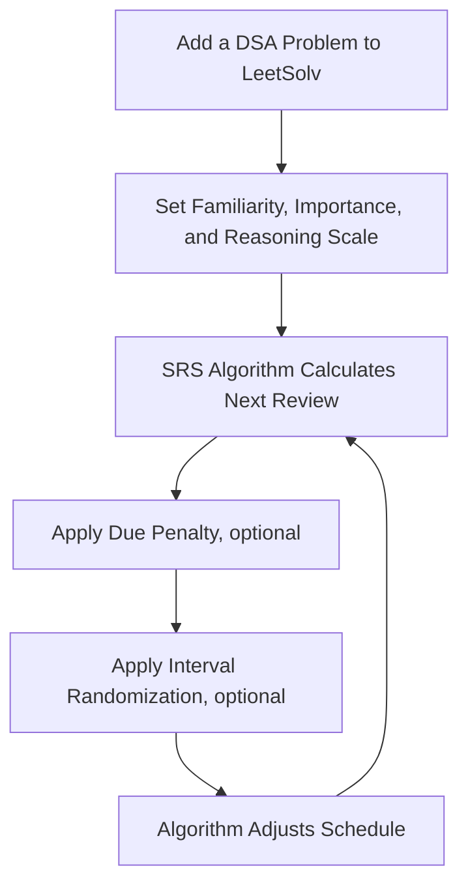
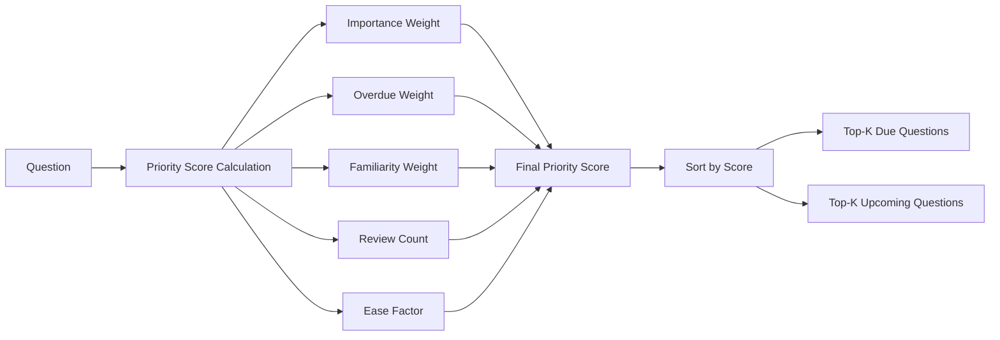
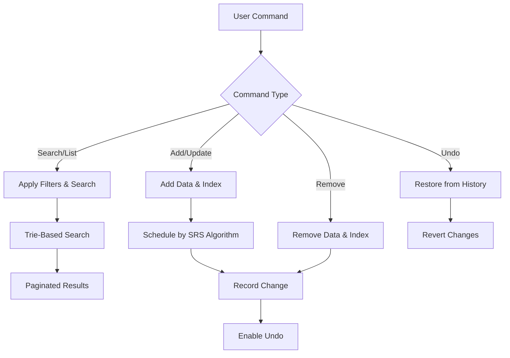
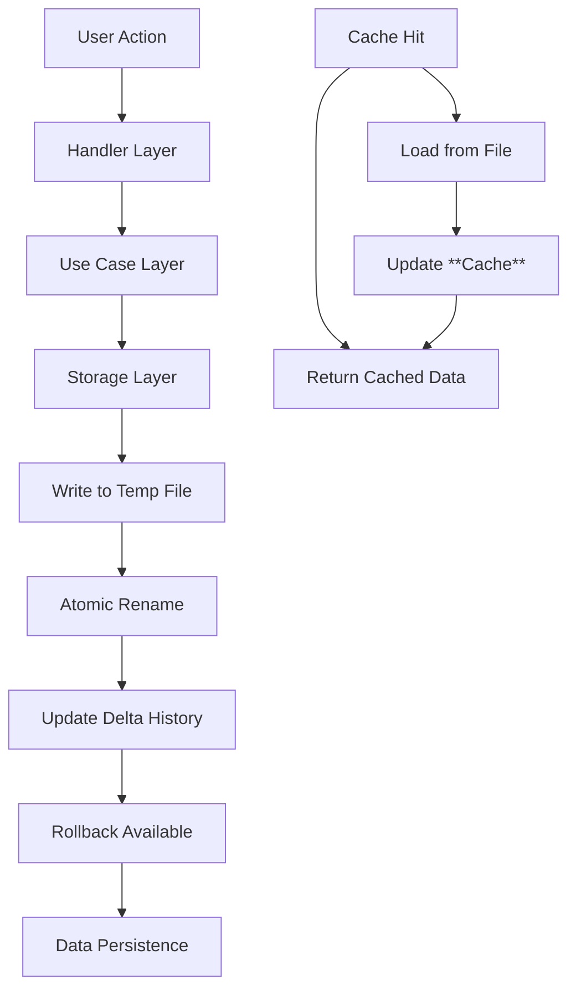
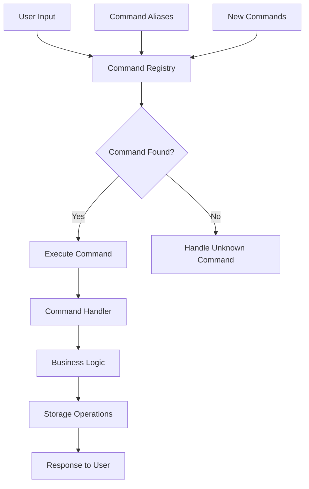

# LeetSolv

A sophisticated spaced repetition command-line tool using SM-2 algorithm with custom adaptations for mastering algorithms and data structures problems.

**🚀 Zero Dependencies Philosophy**: Built entirely in pure Go, without any third-party libraries, APIs, or applications, this project aligns with the spirit of learning data structures and algorithms. Even some built-in Go packages for data structure implementations are not used for granular control.

[🏗️ TODO: Put the app demo here]()

## Table of Contents
- [Features](#features)
  - [Enhanced Spaced Repetition](#enhanced-spaced-repetition)
  - [Due Priority Scheduling](#due-priority-scheduling)
  - [Problem Management](#problem-management)
  - [CLI Interface](#cli-interface)
- [SRS Algorithm](#srs-algorithm)
  - [Interval Growth by Importance Level](#interval-growth-by-importance-level)
- [Quick Installation](#quick-installation)
- [Usage](#usage)
- [Architecture](#architecture)


## Features

### Enhanced Spaced Repetition

After adding a problem, LeetSolv will employ the SM-2 algorithm, with custom adaptations for familiarity, importance, and reasoning scale, to determine the next review date.

- **Importance Scale**: Prioritize problems based on their importance using a 4-tier importance scale: Low, Medium, High, and Critical.
- **Familiarity Scale**: Rate your familiarity with a problem using a 5-level familiarity scale: VeryHard, VeryEasy, Hard, Medium, and Easy.
- **Reasoning Scale**: Apply a penalty if their reasoning is not strong enough using a 3-level reasoning scale: Reasoned, Partial, and Full recall. This aligns with the core spirit of learning algorithms and data structures.
- **Due Penalty (Optional)**: Apply a penalty if the problem is overdue for review.
- **Interval Randomization (Optional)**: Apply random scheduling to prevent over-fitting to specific dates.




### Due Priority Scheduling
Accumulating a significant number of pending issues for review is inevitable for a SRS system, as individuals have their own unique circumstances and schedules. To address this challenge, LeetSolv introduces a due priority scheduling feature that enables users to prioritize pending issues based on a priority score.

- **Multi-Factor Scoring**: Combines importance, familiarity, overdue days, review count, and ease factor




> *By default, the priority score is calculated using the following formula: (1.5×Importance)+(0.5×Overdue Days)+(3.0×Difficulty)+(-1.5×Review Count)+(-1.0×Ease Factor)*


### Problem Management
- **Trie-Based Search & Filtering**: Search and filter problems by keywords, familiarity, importance, review count, and due status
- **Summary View**: Display a concise summary of total problems, due problems, and upcoming problems
- **Pagination Control**: Efficient handling of large problem sets
- **Add/Update Problems**: Add or update a problem with URL and notes
- **Remove Problems**: Remove a problem by ID and URL
- **History Tracking & Undo Capability**: Track all changes and allow undoing from recent actions




### CLI Interface
- **Interactive Mode**: Full-featured interactive CLI
- **Batch Mode**: Execute commands directly from command line arguments
- **Alias Support**: Multiple command aliases for convenience (e.g., `ls`, `rm`, `cfg`)
- **Clear Output**: Well-formatted, readable command output with proper pagination


## SRS Algorithm

LeetSolv implements a customized SM-2 spaced repetition algorithm that adapts review intervals based on problem importance, familiarity, and memory usage. The algorithm ensures that critical problems are reviewed more frequently while allowing easier problems to have longer intervals.

### Interval Growth by Importance Level

The following graphs demonstrate how review intervals grow over time for different importance levels, showing the adaptive nature of the scheduling system:


**Critical Problems**: Shortest intervals with frequent reviews to ensure mastery of the most important concepts.


**High Importance**: Moderate intervals balancing frequency with efficiency for important problems.


**Medium Importance**: Standard intervals following classic SM-2 progression for regular practice.


**Low Importance**: Longer intervals for problems that require less frequent review.

> Algorithm parameters can be adjusted in the configuration file in future versions.


## Quick Installation

### Automated Install (Linux/macOS)
```bash
# Download and run the installation script
curl -fsSL https://raw.githubusercontent.com/eannchen/leetsolv/main/install.sh | bash

# Or download first, then run
wget https://raw.githubusercontent.com/eannchen/leetsolv/main/install.sh
chmod +x install.sh
./install.sh
```

### Manual Download (All Platforms)
1. Go to [Releases](https://github.com/eannchen/leetsolv/releases)
2. Download the binary for your platform:
   - **Linux**: `leetsolv-linux-amd64` or `leetsolv-linux-arm64`
   - **macOS**: `leetsolv-darwin-amd64` or `leetsolv-darwin-arm64`
   - **Windows**: `leetsolv-windows-amd64.exe` or `leetsolv-windows-arm64.exe`

### Verify Installation
```bash
leetsolv version
leetsolv help
```

> **📖 For detailed installation and configuration instructions, see [INSTALL.md](document/INSTALL.md)**


## Usage

### Interactive Mode
```bash
# Start interactive session
./leetsolv

# You'll see the prompt:
leetsolv ❯
```

### Command Line Mode
```bash
# List all questions
./leetsolv list

# Search for problems
./leetsolv search "binary tree"

# Search with filters
./leetsolv search "tree" --familiarity=3 --importance=2 --due-only

# Get problem details
./leetsolv get 123

# Check status
./leetsolv status

# Add new problem
./leetsolv add https://leetcode.com/problems/example
```

### Available Commands

| Command   | Aliases               | Description                                |
| --------- | --------------------- | ------------------------------------------ |
| `list`    | `ls`                  | List all questions with pagination         |
| `search`  | `s`                   | Search questions by keywords               |
| `get`     | `detail`              | Get detailed information about a question  |
| `status`  | `stat`                | Show summary of due and upcoming questions |
| `upsert`  | `add`                 | Add or update a question                   |
| `remove`  | `rm`, `delete`, `del` | Delete a question                          |
| `undo`    | `back`                | Undo the last action                       |
| `history` | `hist`, `log`         | Show action history                        |
| `setting` | `config`, `cfg`       | View and modify application settings       |
| `version` | `ver`, `v`            | Show application version information       |
| `help`    | `h`                   | Show help information                      |
| `clear`   | `cls`                 | Clear the screen                           |
| `quit`    | `q`, `exit`           | Exit the application                       |

## Configuration

### Environment Variables

| Variable                  | Default               | Description         |
| ------------------------- | --------------------- | ------------------- |
| `LEETSOLV_QUESTIONS_FILE` | `questions.test.json` | Questions data file |
| `LEETSOLV_DELTAS_FILE`    | `deltas.test.json`    | Change history file |
| `LEETSOLV_INFO_LOG_FILE`  | `info.test.log`       | Info log file       |
| `LEETSOLV_ERROR_LOG_FILE` | `error.test.log`      | Error log file      |

### SRS Algorithm Settings

| Variable                      | Default | Description                                    |
| ----------------------------- | ------- | ---------------------------------------------- |
| `LEETSOLV_RANDOMIZE_INTERVAL` | `true`  | Enable/disable interval randomization          |
| `LEETSOLV_OVERDUE_PENALTY`    | `false` | Enable/disable overdue penalty system          |
| `LEETSOLV_OVERDUE_LIMIT`      | `7`     | Days after which overdue questions get penalty |

### Scoring Weights

| Variable                         | Default | Description                   |
| -------------------------------- | ------- | ----------------------------- |
| `LEETSOLV_IMPORTANCE_WEIGHT`     | `1.5`   | Weight for problem importance |
| `LEETSOLV_OVERDUE_WEIGHT`        | `0.5`   | Weight for overdue problems   |
| `LEETSOLV_FAMILIARITY_WEIGHT`    | `3.0`   | Weight for difficulty level   |
| `LEETSOLV_REVIEW_PENALTY_WEIGHT` | `-1.5`  | Penalty for high review count |
| `LEETSOLV_EASE_PENALTY_WEIGHT`   | `-1.0`  | Penalty for easy problems     |

### Other Settings

| Variable                  | Default | Description                    |
| ------------------------- | ------- | ------------------------------ |
| `LEETSOLV_PAGE_SIZE`      | `5`     | Questions per page             |
| `LEETSOLV_MAX_DELTA`      | `50`    | Maximum history entries        |
| `LEETSOLV_TOP_K_DUE`      | `10`    | Top due questions to show      |
| `LEETSOLV_TOP_K_UPCOMING` | `10`    | Top upcoming questions to show |


## Architecture

### Zero Dependencies Philosophy
**🚀 Pure Go Implementation**: LeetSolv is built entirely in Go without any external dependencies. This approach offers several advantages:

- **DSA Learning**: Implement every data structure and algorithm from scratch for deep understanding
- **Performance Optimization**: Fine-tune implementations beyond theoretical complexity (e.g., heap operations use O(log n) instead of O(log n) + O(log n))
- **Full Control**: Complete visibility and control over every algorithm's behavior
- **Easy Customization**: Developers can easily modify the SRS algorithm or create clones in other languages
- **Educational Value**: Perfect for learning how algorithms work in practice rather than just using them

### Project Structure
```
leetsolv/
├── core/           # Core domain models and business logic
├── usecase/        # Application use cases and orchestration
├── handler/        # Request handling and user interaction
├── command/        # CLI command implementations
├── storage/        # Data persistence layer
├── internal/       # Internal utilities and helpers
│   ├── clock/     # Time abstraction for testing
│   ├── copy/      # Deep copy utilities
│   ├── errs/      # Structured error handling
│   ├── logger/    # Logging system
│   ├── rank/      # Priority queue algorithms (custom heap implementation)
│   ├── search/    # Trie-based search engine (custom trie with prefix matching)
│   └── tokenizer/ # Text processing utilities
├── config/         # Configuration management
└── main.go         # Application entry point
```

### Key Components

#### Core Domain (`core/`)
- **Question Model**: Central data structure with all problem metadata
- **SM2Scheduler**: Spaced repetition algorithm implementation
- **Action Tracking**: Delta-based change history system

#### Use Cases (`usecase/`)
- **QuestionUseCase**: Main business logic for problem management
- **Search & Filtering**: Advanced query capabilities
- **Priority Calculation**: Intelligent scoring algorithms

#### Storage (`storage/`)
- **File-based Storage**: JSON-based data persistence
- **Delta Tracking**: Change history with rollback support
- **Atomic Operations**: Safe file operations with error handling
- **Intelligent Caching**: Smart cache invalidation and memory management
- **Backup Protection**: Automatic backup creation before major changes



#### Command System (`command/`)
- **Command Registry**: Extensible command system
- **Handler Integration**: Clean separation of concerns
- **Alias Support**: Multiple command names for convenience




## Upcoming Features

1. SRS Algorithm Customization
2. Enhanced Problem Management
    - Non-LeetCode Problem Support
    - Fuzzy Search
    - Tag System
    - Export Functionality


## Performance Features

### Custom Data Structure Implementations
- **Priority Heaps**: Custom heap implementation with optimized O(log n) operations (avoiding O(log n) + O(log n) overhead)
- **Trie Search**: Custom trie implementation with efficient prefix matching and memory management
- **Lazy Loading**: On-demand data loading and processing
- **Smart Caching**: Intelligent cache invalidation and memory management
- **Delta Compression**: Efficient storage of change history with rollback support

### Memory Management
- **Streaming Operations**: Handle large datasets without memory issues
- **Pagination**: Efficient display of large question sets
- **Delta Compression**: Efficient storage of change history

## Data Safety

### File Operations
- **Atomic Writes**: Safe file updates with temporary files
- **Backup Creation**: Automatic backup before major changes
- **Error Recovery**: Graceful handling of file corruption

### History Management
- **Complete Audit Trail**: Every change is recorded
- **Undo Capability**: Rollback any action
- **Delta Storage**: Efficient change tracking

## Contributing

### Why Zero Dependencies?
**🚀 Educational & Customizable**: Every algorithm is implemented from scratch for learning and customization.

### Quick Contribution Guide
1. Fork the repository
2. Create a feature branch
3. Make your changes with tests
4. Submit a pull request

> **📖 For detailed development workflow, architecture principles, and coding standards, see [DEVELOPMENT_GUIDE.md](document/DEVELOPMENT_GUIDE.md)**

## License

This project is licensed under the terms specified in the [LICENSE](LICENSE) file.

## Support & Documentation

### Documentation
- **[INSTALL.md](document/INSTALL.md)**: Complete installation guide with troubleshooting
- **[DEVELOPMENT_GUIDE.md](document/DEVELOPMENT_GUIDE.md)**: Development workflow, CI/CD, and contribution guide
- **This README**: Project overview and quick start

### Links
- **Issues**: [GitHub Issues](https://github.com/eannchen/leetsolv/issues)
- **Discussions**: [GitHub Discussions](https://github.com/eannchen/leetsolv/discussions)
- **Releases**: [GitHub Releases](https://github.com/eannchen/leetsolv/releases)

---

**LeetSolv** - Master LeetCode problems with intelligent spaced repetition.