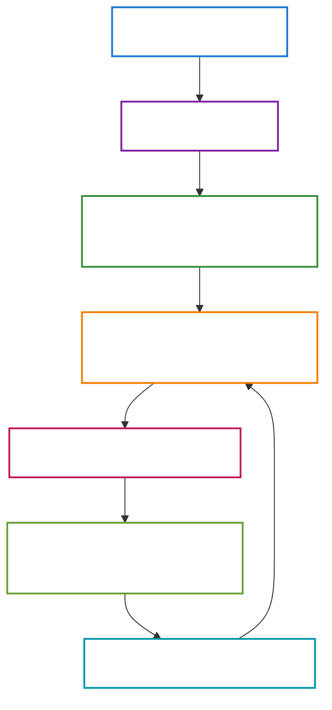
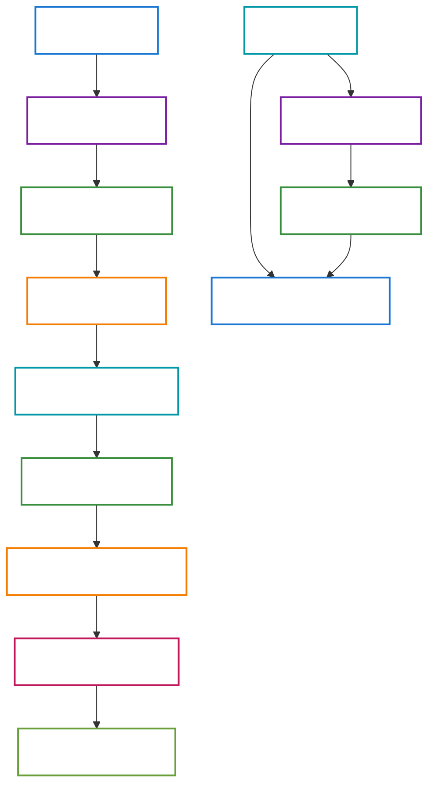

# LeetSolv

A sophisticated spaced repetition system for LeetCode problem management, built in Go with an intelligent scheduling algorithm and comprehensive CLI interface.

## 🎯 Overview

LeetSolv is a command-line tool designed to help developers systematically review and master LeetCode problems using spaced repetition principles. It implements the SM-2 algorithm with custom adaptations for coding interview preparation, featuring intelligent prioritization based on problem difficulty, importance, and review history.

**🚀 Zero Dependencies**: Built entirely in pure Go without any third-party libraries, making it perfect for learning data structures and algorithms while building a practical tool.



## ✨ Features

### Core Functionality
- **Spaced Repetition**: SM-2 algorithm implementation with custom intervals based on problem importance
- **Intelligent Scheduling**: Dynamic review scheduling considering familiarity, importance, and memory retention
- **Priority Scoring**: Advanced scoring system that prioritizes questions based on multiple factors
- **Search & Filtering**: Powerful search capabilities with multiple filter options
- **Trie-based prefix matching** for fast text search
- **Multi-field filtering** by familiarity, importance, and review count
- **Due-only filtering** to focus on overdue problems
- **History Tracking**: Complete audit trail of all changes with undo functionality

### DSA Learning Benefits
- **Custom Implementations**: Every data structure and algorithm is implemented from scratch
- **Performance Optimization**: Fine-tuned implementations that often outperform theoretical complexity
- **Educational Value**: Perfect for understanding how algorithms work in practice
- **No Black Boxes**: Full visibility into every algorithm's implementation

### Problem Management
- **Add/Update Problems**: Easy problem entry with URL and notes
- **Importance Levels**: 4-tier importance system (Low, Medium, High, Critical)
- **Familiarity Tracking**: 5-level familiarity scale (VeryHard → VeryEasy)
- **Memory Assessment**: 3-level memory tracking (Reasoned, Partial, Full recall)
- **Due Date Management**: Automatic calculation of next review dates
- **Smart Scheduling**: Adaptive intervals based on performance and importance

### CLI Interface
- **Interactive Mode**: Full-featured interactive CLI with command history
- **Batch Mode**: Execute commands directly from command line arguments
- **Alias Support**: Multiple command aliases for convenience
- **Pagination**: Efficient handling of large problem sets
- **Clear Output**: Well-formatted, readable command output
- **Graceful Shutdown**: Signal handling with safe cleanup on exit
- **Command History**: Persistent command history across sessions

## 🏗️ Architecture

### Zero Dependencies Philosophy
**🚀 Pure Go Implementation**: LeetSolv is built entirely in Go without any external dependencies. This approach offers several advantages:

- **DSA Learning**: Implement every data structure and algorithm from scratch for deep understanding
- **Performance Optimization**: Fine-tune implementations beyond theoretical complexity (e.g., heap operations use O(log n) instead of O(log n) + O(log n))
- **Full Control**: Complete visibility and control over every algorithm's behavior
- **Easy Customization**: Developers can easily modify the SRS algorithm or create clones in other languages
- **Educational Value**: Perfect for learning how algorithms work in practice rather than just using them

### Project Structure
```
leetsolv/
├── core/           # Core domain models and business logic
├── usecase/        # Application use cases and orchestration
├── handler/        # Request handling and user interaction
├── command/        # CLI command implementations
├── storage/        # Data persistence layer
├── internal/       # Internal utilities and helpers
│   ├── clock/     # Time abstraction for testing
│   ├── copy/      # Deep copy utilities
│   ├── errs/      # Structured error handling
│   ├── logger/    # Logging system
│   ├── rank/      # Priority queue algorithms (custom heap implementation)
│   ├── search/    # Trie-based search engine (custom trie with prefix matching)
│   └── tokenizer/ # Text processing utilities
├── config/         # Configuration management
└── main.go         # Application entry point
```

### Key Components

#### Core Domain (`core/`)
- **Question Model**: Central data structure with all problem metadata
- **SM2Scheduler**: Spaced repetition algorithm implementation
- **Action Tracking**: Delta-based change history system

#### Use Cases (`usecase/`)
- **QuestionUseCase**: Main business logic for problem management
- **Search & Filtering**: Advanced query capabilities
- **Priority Calculation**: Intelligent scoring algorithms

#### Storage (`storage/`)
- **File-based Storage**: JSON-based data persistence
- **Delta Tracking**: Change history with rollback support
- **Atomic Operations**: Safe file operations with error handling
- **Intelligent Caching**: Smart cache invalidation and memory management
- **Backup Protection**: Automatic backup creation before major changes



#### Command System (`command/`)
- **Command Registry**: Extensible command system
- **Handler Integration**: Clean separation of concerns
- **Alias Support**: Multiple command names for convenience


## 🚀 Quick Installation

### One-Command Install
```bash
# Linux/macOS
curl -fsSL https://raw.githubusercontent.com/eannchen/leetsolv/main/install.sh | bash

# Windows (PowerShell)
Invoke-WebRequest -Uri 'https://raw.githubusercontent.com/eannchen/leetsolv/main/install.ps1' -OutFile 'install.ps1'; .\install.ps1
```

### Verify Installation
```bash
leetsolv version
leetsolv help
```

> **📖 For detailed installation options, troubleshooting, and platform-specific instructions, see [INSTALL.md](document/INSTALL.md)**

## 📖 Usage

### Interactive Mode
```bash
# Start interactive session
./leetsolv

# You'll see the prompt:
leetsolv ❯
```

### Command Line Mode
```bash
# List all questions
./leetsolv list

# Search for problems
./leetsolv search "binary tree"

# Search with filters
./leetsolv search "tree" --familiarity=3 --importance=2 --due-only

# Get problem details
./leetsolv get 123

# Check status
./leetsolv status

# Add new problem
./leetsolv add "https://leetcode.com/problems/example"
```

### Available Commands

| Command   | Aliases               | Description                                |
| --------- | --------------------- | ------------------------------------------ |
| `list`    | `ls`                  | List all questions with pagination         |
| `search`  | `s`                   | Search questions by keywords               |
| `get`     | `detail`              | Get detailed information about a question  |
| `status`  | `stat`                | Show summary of due and upcoming questions |
| `add`     | `upsert`              | Add or update a question                   |
| `remove`  | `rm`, `delete`, `del` | Delete a question                          |
| `undo`    | `back`                | Undo the last action                       |
| `history` | `hist`, `log`         | Show action history                        |
| `setting` | `config`              | View and modify application settings       |
| `version` | `ver`, `v`            | Show application version information       |
| `help`    | `h`                   | Show help information                      |
| `clear`   | `cls`                 | Clear the screen                           |
| `quit`    | `q`, `exit`           | Exit the application                       |

## ⚙️ Configuration

### Environment Variables

| Variable                  | Default               | Description         |
| ------------------------- | --------------------- | ------------------- |
| `LEETSOLV_QUESTIONS_FILE` | `questions.test.json` | Questions data file |
| `LEETSOLV_DELTAS_FILE`    | `deltas.test.json`    | Change history file |
| `LEETSOLV_INFO_LOG_FILE`  | `info.test.log`       | Info log file       |
| `LEETSOLV_ERROR_LOG_FILE` | `error.test.log`      | Error log file      |

### Scoring Weights

| Variable                         | Default | Description                   |
| -------------------------------- | ------- | ----------------------------- |
| `LEETSOLV_IMPORTANCE_WEIGHT`     | `1.5`   | Weight for problem importance |
| `LEETSOLV_OVERDUE_WEIGHT`        | `0.5`   | Weight for overdue problems   |
| `LEETSOLV_FAMILIARITY_WEIGHT`    | `3.0`   | Weight for difficulty level   |
| `LEETSOLV_REVIEW_PENALTY_WEIGHT` | `-1.5`  | Penalty for high review count |
| `LEETSOLV_EASE_PENALTY_WEIGHT`   | `-1.0`  | Penalty for easy problems     |

### Other Settings

| Variable                  | Default | Description                    |
| ------------------------- | ------- | ------------------------------ |
| `LEETSOLV_PAGE_SIZE`      | `5`     | Questions per page             |
| `LEETSOLV_MAX_DELTA`      | `50`    | Maximum history entries        |
| `LEETSOLV_TOP_K_DUE`      | `10`    | Top due questions to show      |
| `LEETSOLV_TOP_K_UPCOMING` | `10`    | Top upcoming questions to show |

### SRS Algorithm Settings

| Variable                      | Default | Description                                    |
| ----------------------------- | ------- | ---------------------------------------------- |
| `LEETSOLV_RANDOMIZE_INTERVAL` | `true`  | Enable/disable interval randomization          |
| `LEETSOLV_OVERDUE_PENALTY`    | `false` | Enable/disable overdue penalty system          |
| `LEETSOLV_OVERDUE_LIMIT`      | `7`     | Days after which overdue questions get penalty |

## 🔧 Development

### Quick Development Setup
```bash
# Clone and setup
git clone https://github.com/eannchen/leetsolv.git
cd leetsolv
go mod download

# Run tests
make test

# Build locally
make build
```

> **📖 For complete development workflow, CI/CD setup, and contribution guidelines, see [DEVELOPMENT_GUIDE.md](document/DEVELOPMENT_GUIDE.md)**

## 📊 Data Model

### Question Structure
```go
type Question struct {
    ID           int         // Unique identifier
    URL          string      // LeetCode problem URL
    Note         string      // Personal notes
    Familiarity  Familiarity // Difficulty level (VeryHard → VeryEasy)
    Importance   Importance  // Priority level (Low → Critical)
    LastReviewed time.Time   // Last review timestamp
    NextReview   time.Time   // Next scheduled review
    ReviewCount  int         // Number of reviews completed
    EaseFactor   float64     // SM-2 ease factor
    UpdatedAt    time.Time   // Last modification time
    CreatedAt    time.Time   // Creation timestamp
}

type MemoryUse int
const (
    MemoryReasoned MemoryUse = iota // Solved with reasoning
    MemoryPartial                    // Partially remembered
    MemoryFull                       // Fully remembered
)
```

### Scheduling Algorithm
The SM-2 scheduler adapts the standard spaced repetition algorithm:

1. **Base Intervals**: Different starting intervals based on importance
2. **Memory Multipliers**: Adjust intervals based on memory performance
3. **Familiarity Adjustments**: Early difficulty signals affect scheduling
4. **Ease Factor Management**: Dynamic adjustment of review intervals
5. **Maximum Limits**: Prevents excessively long intervals
6. **Interval Randomization**: Prevents over-fitting to specific dates
7. **Overdue Penalties**: Automatic difficulty adjustment for neglected problems
8. **Stability Bonuses**: Rewards consistent performance over time

```mermaid
flowchart TD
    A[New Question] --> B[Set Base Interval by Importance]
    B --> C[Calculate Initial Ease Factor]
    C --> D[Schedule First Review]

    E[Review Question] --> F[Assess Memory Performance]
    F --> G{Memory Assessment}
    G -->|Reasoned| H[Increase Interval × Ease Factor]
    G -->|Partial| I[Smaller Increase]
    G -->|Full| J[Larger Increase]

    H --> K[Adjust Ease Factor]
    I --> K
    J --> K

    K --> L[Apply Familiarity Penalties]
    L --> M[Apply Importance Bonuses]
    M --> N[Randomize Interval ±1 day]
    N --> O[Schedule Next Review]
    O --> E

    style A fill:#2196F3,fill-opacity:0,stroke:#1976D2,stroke-width:2px,color:#ffffff
    style B fill:#9C27B0,fill-opacity:0,stroke:#7B1FA2,stroke-width:2px,color:#ffffff
    style C fill:#4CAF50,fill-opacity:0,stroke:#388E3C,stroke-width:2px,color:#ffffff
    style D fill:#FF9800,fill-opacity:0,stroke:#F57C00,stroke-width:2px,color:#ffffff
    style E fill:#E91E63,fill-opacity:0,stroke:#C2185B,stroke-width:2px,color:#ffffff
    style F fill:#8BC34A,fill-opacity:0,stroke:#689F38,stroke-width:2px,color:#ffffff
    style G fill:#00BCD4,fill-opacity:0,stroke:#0097A7,stroke-width:2px,color:#ffffff
    style H fill:#4CAF50,fill-opacity:0,stroke:#388E3C,stroke-width:2px,color:#ffffff
    style I fill:#FF9800,fill-opacity:0,stroke:#F57C00,stroke-width:2px,color:#ffffff
    style J fill:#E91E63,fill-opacity:0,stroke:#C2185B,stroke-width:2px,color:#ffffff
    style K fill:#9C27B0,fill-opacity:0,stroke:#7B1FA2,stroke-width:2px,color:#ffffff
    style L fill:#2196F3,fill-opacity:0,stroke:#1976D2,stroke-width:2px,color:#ffffff
    style M fill:#4CAF50,fill-opacity:0,stroke:#388E3C,stroke-width:2px,color:#ffffff
    style N fill:#FF9800,fill-opacity:0,stroke:#F57C00,stroke-width:2px,color:#ffffff
    style O fill:#8BC34A,fill-opacity:0,stroke:#689F38,stroke-width:2px,color:#ffffff
```



## 🚀 Advanced Features

### Memory Assessment System
- **Three-Level Memory Tracking**: Reasoned, Partial, and Full recall assessment
- **Interactive Assessment Flow**: Guided prompts for familiarity and memory evaluation
- **Adaptive Scheduling**: Intervals adjust based on memory performance
- **Performance Analytics**: Track improvement over time with detailed metrics


### Intelligent Prioritization
- **Multi-Factor Scoring**: Combines importance, familiarity, overdue status, and review count
- **Dynamic Weighting**: Configurable weights for different priority factors
- **Anti-Leeching**: Prevents easy problems from dominating review sessions

```mermaid
graph LR
    A[Question] --> B[Priority Score Calculation]
    B --> C[Importance Weight × 1.5]
    B --> D[Overdue Weight × 0.5]
    B --> E[Familiarity Weight × 3.0]
    B --> F[Review Penalty × -1.5]
    B --> G[Ease Penalty × -1.0]

    C --> H[Final Priority Score]
    D --> H
    E --> H
    F --> H
    G --> H

    H --> I[Sort by Score]
    I --> J[Top-K Due Questions]
    I --> K[Top-K Upcoming Questions]

    style A fill:#2196F3,fill-opacity:0,stroke:#1976D2,stroke-width:2px,color:#ffffff
    style B fill:#9C27B0,fill-opacity:0,stroke:#7B1FA2,stroke-width:2px,color:#ffffff
    style C fill:#4CAF50,fill-opacity:0,stroke:#388E3C,stroke-width:2px,color:#ffffff
    style D fill:#FF9800,fill-opacity:0,stroke:#F57C00,stroke-width:2px,color:#ffffff
    style E fill:#E91E63,fill-opacity:0,stroke:#C2185B,stroke-width:2px,color:#ffffff
    style F fill:#F44336,fill-opacity:0,stroke:#D32F2F,stroke-width:2px,color:#ffffff
    style G fill:#F44336,fill-opacity:0,stroke:#D32F2F,stroke-width:2px,color:#ffffff
    style H fill:#8BC34A,fill-opacity:0,stroke:#689F38,stroke-width:2px,color:#ffffff
    style I fill:#00BCD4,fill-opacity:0,stroke:#0097A7,stroke-width:2px,color:#ffffff
    style J fill:#4CAF50,fill-opacity:0,stroke:#388E3C,stroke-width:2px,color:#ffffff
    style K fill:#FF9800,fill-opacity:0,stroke:#F57C00,stroke-width:2px,color:#ffffff
```



### Advanced Search Engine
- **Trie-Based Indexing**: Fast prefix matching for URLs and notes
- **Multi-Field Filtering**: Filter by familiarity, importance, review count, and due status
- **Fuzzy Matching**: Flexible search with partial text matching


## 🔮 Upcoming Features

### Enhanced Problem Organization
- **Tag System**: Categorize problems by topics, difficulty, or custom tags
- **Export Functionality**: Export your problem data in various formats (JSON, CSV, etc.)

### Advanced SRS Customization
- **Growth Curve Editor**: Interactive command to tweak SRS algorithm parameters
- **Custom Scheduling Rules**: Fine-tune the spaced repetition algorithm to match your learning style
- **Algorithm Visualization**: See how your changes affect the review schedule


## 🚀 Performance Features

### Custom Data Structure Implementations
- **Priority Heaps**: Custom heap implementation with optimized O(log n) operations (avoiding O(log n) + O(log n) overhead)
- **Trie Search**: Custom trie implementation with efficient prefix matching and memory management
- **Lazy Loading**: On-demand data loading and processing
- **Smart Caching**: Intelligent cache invalidation and memory management
- **Delta Compression**: Efficient storage of change history with rollback support

### Memory Management
- **Streaming Operations**: Handle large datasets without memory issues
- **Pagination**: Efficient display of large question sets
- **Delta Compression**: Efficient storage of change history

## 🔒 Data Safety

### File Operations
- **Atomic Writes**: Safe file updates with temporary files
- **Backup Creation**: Automatic backup before major changes
- **Error Recovery**: Graceful handling of file corruption

### History Management
- **Complete Audit Trail**: Every change is recorded
- **Undo Capability**: Rollback any action
- **Delta Storage**: Efficient change tracking

## 🤝 Contributing

### Why Zero Dependencies?
**🚀 Educational & Customizable**: Every algorithm is implemented from scratch for learning and customization.

### Quick Contribution Guide
1. Fork the repository
2. Create a feature branch
3. Make your changes with tests
4. Submit a pull request

> **📖 For detailed development workflow, architecture principles, and coding standards, see [DEVELOPMENT_GUIDE.md](document/DEVELOPMENT_GUIDE.md)**

## 📝 License

This project is licensed under the terms specified in the [LICENSE](LICENSE) file.

## 🆘 Support & Documentation

### 📚 Documentation
- **[INSTALL.md](document/INSTALL.md)**: Complete installation guide with troubleshooting
- **[DEVELOPMENT_GUIDE.md](document/DEVELOPMENT_GUIDE.md)**: Development workflow, CI/CD, and contribution guide
- **This README**: Project overview and quick start

### 🔗 Links
- **Issues**: [GitHub Issues](https://github.com/eannchen/leetsolv/issues)
- **Discussions**: [GitHub Discussions](https://github.com/eannchen/leetsolv/discussions)
- **Releases**: [GitHub Releases](https://github.com/eannchen/leetsolv/releases)

---

**LeetSolv** - Master LeetCode problems with intelligent spaced repetition.