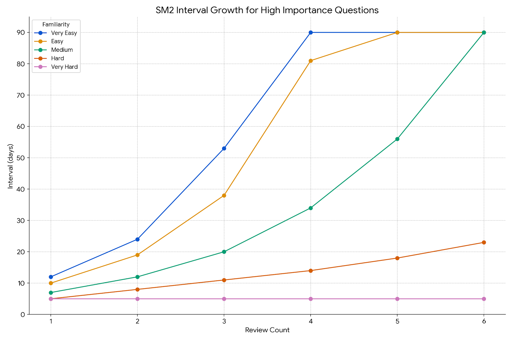
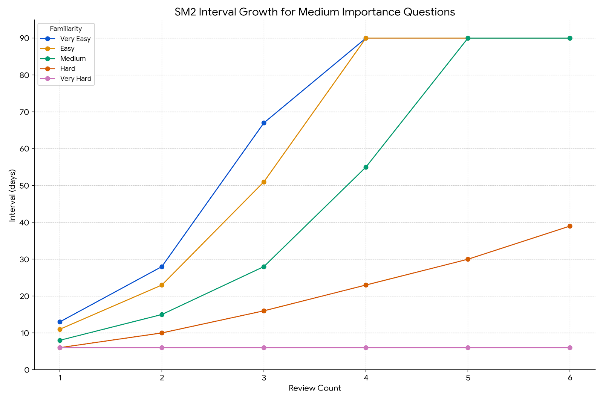

[English](./README.md) | [繁體中文](./README.zh-TW.md) | [简体中文](./README.zh-CN.md)


# LeetSolv

**LeetSolv** is a command-line tool designed for **Data Structures and Algorithms (DSA)** problem revision. It's powered by a custom-adapted [SuperMemo 2](https://en.wikipedia.org/wiki/SuperMemo) algorithm that incorporates variables such as **familiarity**, **importance**, and **reasoning**. This unique approach moves beyond rote memorization, helping you to **master** complex algorithms through **deliberate practice**.

> ***0️⃣ Zero Dependencies Philosophy**: Implemented entirely in pure Go with no third-party libraries, APIs, or external tools. Even some standard packages are avoided to give full control over the underlying implementations—highlighting the project’s focus on fundamentals. For more details, see [MOTIVATION.md](document/MOTIVATION.md)*.

**The LeetSolv Workflow:**

This diagram illustrates the recommended daily workflow for using LeetSolv effectively.


## Table of Contents
- [LeetSolv](#leetsolv)
  - [Table of Contents](#table-of-contents)
  - [Quick Installation](#quick-installation)
    - [Automated Install (Linux/macOS)](#automated-install-linuxmacos)
    - [Manual Download (All Platforms)](#manual-download-all-platforms)
    - [Verify Installation](#verify-installation)
  - [Review Scheduling System](#review-scheduling-system)
    - [Adaptive SM-2 Algorithm](#adaptive-sm-2-algorithm)
    - [Due Priority Scoring](#due-priority-scoring)
    - [Interval Growing Curve](#interval-growing-curve)
  - [Problem Management](#problem-management)
    - [CRUD + undo](#crud--undo)
    - [Data Privacy \& Safety](#data-privacy--safety)
    - [CLI Interface](#cli-interface)
  - [Usage](#usage)
    - [Interactive Mode](#interactive-mode)
    - [Command Line Mode](#command-line-mode)
    - [Available Commands](#available-commands)
    - [Search Command Filters](#search-command-filters)
  - [Configuration](#configuration)
    - [File Paths](#file-paths)
    - [SM-2 Algorithm Settings](#sm-2-algorithm-settings)
    - [Due Priority Scoring Settings](#due-priority-scoring-settings)
    - [Other Settings](#other-settings)
    - [Example: Environment Variables](#example-environment-variables)
    - [Example: JSON Settings File](#example-json-settings-file)
  - [Roadmap](#roadmap)
    - [Installation \& Running](#installation--running)
    - [Features](#features)
    - [Documentation](#documentation)
  - [License](#license)
  - [Support](#support)
    - [FAQ](#faq)
      - [Q: Should I add all my previously solved problems?](#q-should-i-add-all-my-previously-solved-problems)
      - [Q: After a period of use, I accumulated too many due problems.](#q-after-a-period-of-use-i-accumulated-too-many-due-problems)
    - [Documentation](#documentation-1)
    - [Links](#links)

## Quick Installation

### Automated Install (Linux/macOS)
```bash
# Download and run the installation script
curl -fsSL https://raw.githubusercontent.com/eannchen/leetsolv/main/install.sh | bash

# Or download first, then run
wget https://raw.githubusercontent.com/eannchen/leetsolv/main/install.sh
chmod +x install.sh
./install.sh
```

### Manual Download (All Platforms)
1. Go to [Releases](https://github.com/eannchen/leetsolv/releases)
2. Download the binary for your platform:
   - **Linux**: `leetsolv-linux-amd64` or `leetsolv-linux-arm64`
   - **macOS**: `leetsolv-darwin-amd64` or `leetsolv-darwin-arm64`
   - **Windows**: `leetsolv-windows-amd64.exe` or `leetsolv-windows-arm64.exe`

### Verify Installation
```bash
leetsolv version
leetsolv help
```

> *For detailed installation and configuration instructions, see [INSTALL.md](document/INSTALL.md)*


## Review Scheduling System

### Adaptive SM-2 Algorithm

When a problem is added, LeetSolv applies the SM-2 algorithm with custom factors—**familiarity**, **importance**, and **reasoning** to calculate the next review date using the ease factor.

- **Ease Factor**: Classic SM-2 algorithm determinant for calculating next review intervals.
- **Familiarity Scale**: 5-level familiarity assessment (`VeryHard`, `Hard`, `Medium`, `Easy`, `VeryEasy`) for personal rating.
- **Importance Scale**: 4-tier priority system (`Low`, `Medium`, `High`, `Critical`) for problem prioritization.
- **Reasoning Scale**: 3-level memory assessment (`Reasoned`, `Partial`, `Full recall`) with penalties for weak reasoning. This design reinforces the goal of mastering data structures and algorithms through reasoning rather than rote recall.
- **Due Penalty (Optional)**: Automatic penalty system for overdue review problems.
- **Randomization (Optional)**: Random scheduling variation to prevent date over-fitting.


> *Check here to learn more about the algorithm: [Interval Growth Curve](#interval-growing-curve)*


### Due Priority Scoring
With SM-2, due reviews can easily accumulate since users have varying schedules and study habits. To address this challenge, LeetSolv introduces a due priority scoring feature that **allows users to prioritize due questions based on a priority score**.

- **Multi-Factor Scoring**: A combination of importance, familiarity, overdue days, review count, and ease factor determines due priority.


> *By default, the priority score is calculated using the following formula: (1.5×Importance)+(0.5×Overdue Days)+(3.0×Familiarity)+(-1.5×Review Count)+(-1.0×Ease Factor)*

**Due priority list demo:**


### Interval Growing Curve

LeetSolv adapts SM-2 intervals based on importance, familiarity, and reasoning. **Critical problems are reviewed more often, while easier ones gradually get longer intervals.**

The following graphs demonstrate how review intervals grow over time for different importance levels, showing the default growth pattern:


**Critical Problems**: Shortest intervals with frequent reviews to ensure mastery of the most important concepts.


**High Importance**: Moderate intervals balancing frequency with efficiency for important problems.


**Medium Importance**: Standard intervals following classic SM-2 progression for regular practice.


**Low Importance**: Longer intervals for problems that require less frequent review.

> *Future iterations may enable the modification of algorithm parameters directly within the configuration file.*


## Problem Management

### CRUD + undo
- **Summary View**: Overview of total problems, due problems, and upcoming problems with [priority scoring](#due-priority-scoring).
- **List View**: List all problems with pagination.
- **Trie-Based Search & Filtering**: Fast search and filtering by keywords, familiarity, importance, review count, and due status.
- **Get Problem Details**: Retrieve detailed information about a specific problem.
- **Add/Update Problems**: Create or modify problems with URL and notes.
- **Remove Problems**: Delete problems by ID and URL.
- **History & Undo**: Track changes and revert recent actions.


**Search, History, Delete, Undo functionality demo:**


### Data Privacy & Safety

- **No Data Collection**: LeetSolv does not upload user data to the internet.
- **Atomic Writes**: All updates use temporary files with atomic replacement to guarantee consistency and prevent data loss.


### CLI Interface
- **Interactive Mode**: A turn-based dialogue between the user and the program.
- **Batch Mode**: Execute commands directly from the command line.
- **Alias Support**: Intuitive shortcuts for convenience (e.g., `ls`, `rm`, `cfg`).
- **Pagination**: Efficient navigation for large problem sets.
- **Clear Output**: Structured, color-coded CLI output.

**Pagination demo:**


## Usage

### Interactive Mode
```bash
# Start interactive session
leetsolv

# You'll see the prompt:
leetsolv ❯
```

### Command Line Mode
```bash
# List all questions
leetsolv list

# Search for problems with filters
leetsolv search tree --familiarity=3 --importance=2 --due-only

# Get problem details
leetsolv detail 123

# Check status
leetsolv status

# Add new problem
leetsolv add https://leetcode.com/problems/example
```

### Available Commands

| Command   | Aliases               | Description                                     |
| --------- | --------------------- | ----------------------------------------------- |
| `list`    | `ls`                  | List all questions with pagination              |
| `search`  | `s`                   | Search questions by keywords (supports filters) |
| `detail`  | `get`                 | Get detailed information about a question       |
| `status`  | `stat`                | Show summary of due and upcoming questions      |
| `upsert`  | `add`                 | Add or update a question                        |
| `remove`  | `rm`, `delete`, `del` | Delete a question                               |
| `undo`    | `back`                | Undo the last action                            |
| `history` | `hist`, `log`         | Show action history                             |
| `setting` | `config`, `cfg`       | View and modify application settings            |
| `version` | `ver`, `v`            | Show application version information            |
| `help`    | `h`                   | Show help information                           |
| `clear`   | `cls`                 | Clear the screen                                |
| `quit`    | `q`, `exit`           | Exit the application                            |


### Search Command Filters

The `search` command lets you search by keywords (in **URL** or **note**) and refine results using filters.

**Syntax:**
```bash
search [keywords...] [filters...]
```

**Filters:**

| Filter             | Description                       |
| ------------------ | --------------------------------- |
| `--familiarity=N`  | Filter by familiarity level (1-5) |
| `--importance=N`   | Filter by importance level (1-4)  |
| `--review-count=N` | Filter by review count            |
| `--due-only`       | Only show due questions           |


## Configuration

You can configure **LeetSolv** in two ways:

1. **Environment variables** – convenient for temporary or deployment-level overrides.
2. **JSON settings file** (`$HOME/.leetsolv/settings.json`) – persistent configuration you can edit manually.

Both methods map to the same internal configuration.
- Environment variables follow `UPPERCASE_SNAKE_CASE` naming.
- JSON fields follow `camelCase` naming.

For example:
- Env var: `LEETSOLV_RANDOMIZE_INTERVAL=true`
- JSON: `"randomizeInterval": true`

If both are provided, the **JSON settings file takes priority** over environment variables.

### File Paths

| Env Variable              | JSON field      | Default                          | Description         |
| ------------------------- | --------------- | -------------------------------- | ------------------- |
| `LEETSOLV_QUESTIONS_FILE` | `questionsFile` | `$HOME/.leetsolv/questions.json` | Questions data file |
| `LEETSOLV_DELTAS_FILE`    | `deltasFile`    | `$HOME/.leetsolv/deltas.json`    | Change history file |
| `LEETSOLV_INFO_LOG_FILE`  | `infoLogFile`   | `$HOME/.leetsolv/info.log`       | Info log file       |
| `LEETSOLV_ERROR_LOG_FILE` | `errorLogFile`  | `$HOME/.leetsolv/error.log`      | Error log file      |
| `LEETSOLV_SETTINGS_FILE`  | `settingsFile`  | `$HOME/.leetsolv/settings.json`  | Config JSON file    |


### SM-2 Algorithm Settings

| Env Variable                  | JSON field          | Default | Description                                    |
| ----------------------------- | ------------------- | ------- | ---------------------------------------------- |
| `LEETSOLV_RANDOMIZE_INTERVAL` | `randomizeInterval` | `true`  | Enable/disable interval randomization          |
| `LEETSOLV_OVERDUE_PENALTY`    | `overduePenalty`    | `false` | Enable/disable overdue penalty system          |
| `LEETSOLV_OVERDUE_LIMIT`      | `overdueLimit`      | `7`     | Days after which overdue questions get penalty |


### Due Priority Scoring Settings

| Env Variable                     | JSON field            | Default | Description                    |
| -------------------------------- | --------------------- | ------- | ------------------------------ |
| `LEETSOLV_TOP_K_DUE`             | `topKDue`             | `10`    | Top due questions to show      |
| `LEETSOLV_TOP_K_UPCOMING`        | `topKUpcoming`        | `10`    | Top upcoming questions to show |
| `LEETSOLV_IMPORTANCE_WEIGHT`     | `importanceWeight`    | `1.5`   | Weight for problem importance  |
| `LEETSOLV_OVERDUE_WEIGHT`        | `overdueWeight`       | `0.5`   | Weight for overdue problems    |
| `LEETSOLV_FAMILIARITY_WEIGHT`    | `familiarityWeight`   | `3.0`   | Weight for familiarity level   |
| `LEETSOLV_REVIEW_PENALTY_WEIGHT` | `reviewPenaltyWeight` | `-1.5`  | Penalty for high review count  |
| `LEETSOLV_EASE_PENALTY_WEIGHT`   | `easePenaltyWeight`   | `-1.0`  | Penalty for easy problems      |


### Other Settings

| Env Variable         | JSON field | Default | Description             |
| -------------------- | ---------- | ------- | ----------------------- |
| `LEETSOLV_PAGE_SIZE` | `pageSize` | `5`     | Questions per page      |
| `LEETSOLV_MAX_DELTA` | `maxDelta` | `50`    | Maximum history entries |

### Example: Environment Variables

```bash
export LEETSOLV_RANDOMIZE_INTERVAL=false
export LEETSOLV_PAGE_SIZE=20
```

### Example: JSON Settings File

```json
{
    "randomizeInterval": false,
    "pageSize": 20
}
```


## Roadmap

### Installation & Running

- Support installation via package managers (Homebrew, Chocolatey, apt)
- Support running as a Docker container
- Support auto-updater functionality
- Add Windows installation script

### Features

- Provide tagging functionality
- Provide export functionality
- Add support for DSA problems from other platforms
- Make SM-2 algorithm user-customizable
- Implement fuzzy search functionality

### Documentation

- Write multi-language documentation

## License

This project is licensed under the terms specified in the [LICENSE](LICENSE) file.

## Support

### FAQ

#### Q: Should I add all my previously solved problems?

A: **No.** LeetSolv is not a solved-problem database — it’s a spaced repetition scheduler.
Only add problems you actually want to revisit. The scheduling algorithm relies on the date you add a problem to calculate reviews, so bulk-adding will create an unrealistic schedule and an overwhelming pile of due problems.

👉 Tip: If you want to review an old problem you solved months ago, just re-solve it first, then add it to LeetSolv on that day. This way the "last seen" date is accurate.

#### Q: After a period of use, I accumulated too many due problems.

A: This is the nature of the **SM-2 algorithm** — if you skip days or add many problems at once, the due list can grow quickly.
To make this manageable, LeetSolv introduces **[Due Priority Scoring](#due-priority-scoring)**, which ranks due problems by importance, familiarity, overdue days, review count, and ease factor.
Instead of clearing everything at once, just focus on the **highest-priority problems** first. The rest can safely wait until later.

👉 Tip: Once you’ve mastered a problem and re-solved it a few times, you can safely remove it from LeetSolv. The goal isn’t to track everything forever, but to focus on problems that still need spaced practice.


### Documentation
- **[INSTALL.md](document/INSTALL.md)**: Complete installation guide with troubleshooting
- **[DEVELOPMENT_GUIDE.md](document/DEVELOPMENT_GUIDE.md)**: Development workflow, CI/CD, and contribution guide
- **[MOTIVATION.md](document/MOTIVATION.md)**: Project motivation and design notes
- **This README**: Project overview and quick start

### Links
- **Issues**: [GitHub Issues](https://github.com/eannchen/leetsolv/issues)
- **Discussions**: [GitHub Discussions](https://github.com/eannchen/leetsolv/discussions)
- **Releases**: [GitHub Releases](https://github.com/eannchen/leetsolv/releases)

---

**LeetSolv** - A CLI tool for DSA problem revision, powered by a custom SM-2 algorithm to help you master algorithms through deliberate practice.