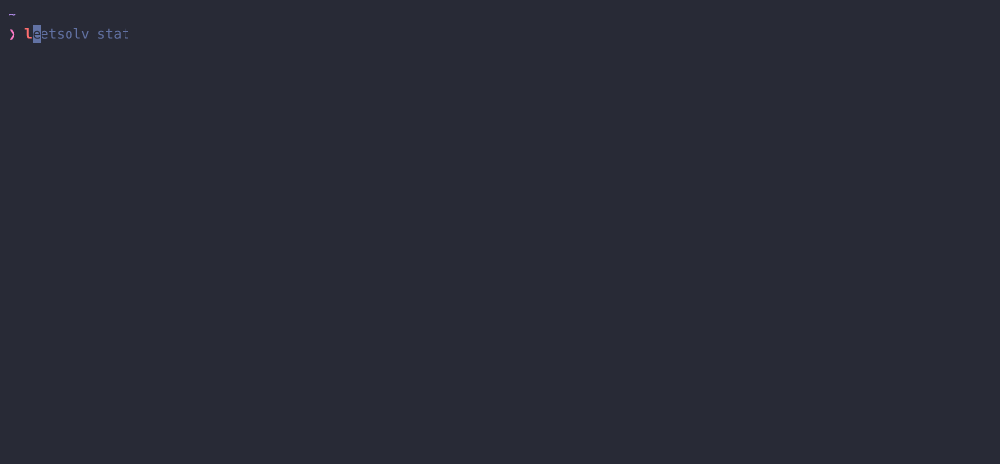

<div align="center">

# LeetSolv

[](https://github.com/eannchen/leetsolv/releases)
[](https://goreportcard.com/report/github.com/eannchen/leetsolv)
[](https://github.com/eannchen/leetsolv/actions/workflows/ci.yml)

[English](./README.md) | [繁體中文](./README.zh-TW.md) | [简体中文](./README.zh-CN.md)

</div>

**LeetSolv** is a CLI tool for Data Structures and Algorithms (DSA) problem revision with **spaced repetition**. It supports problems from [LeetCode](https://leetcode.com) and [HackerRank](https://hackerrank.com). Powered by a customized [SuperMemo 2](https://en.wikipedia.org/wiki/SuperMemo) algorithm that incorporates **familiarity**, **importance**, and **reasoning** to move beyond rote memorization.


## Table of Contents
- [Installation](#installation)
- [Usage](#usage)
- [Review Scheduling System](#review-scheduling-system)
- [Problem Management](#problem-management)
- [Configuration](#configuration)
- [FAQ](#faq)

## Installation

### Scoop (Windows)

```powershell
scoop bucket add eannchen https://github.com/eannchen/scoop-bucket
scoop install leetsolv
```

### Homebrew (macOS/Linux)

```bash
brew install leetsolv
```

### Shell Script (macOS/Linux)

```bash
curl -fsSL https://raw.githubusercontent.com/eannchen/leetsolv/main/install.sh | bash
```

To uninstall:

```bash
curl -fsSL https://raw.githubusercontent.com/eannchen/leetsolv/main/install.sh | bash -s -- --uninstall
```

## Usage

LeetSolv can be run interactively or by passing commands directly from your terminal.

```bash
# Start interactive mode
leetsolv

# Or run commands directly
leetsolv add https://leetcode.com/problems/two-sum
leetsolv status

# Get help
leetsolv help
```

[View Full Usage Guide (USAGE.md)](document/USAGE.md)

## Review Scheduling System

### Adaptive SM-2 Algorithm

Unlike standard SM-2 (used by Anki), LeetSolv adds **importance** and **reasoning** factors—designed for DSA practice, not flashcard memorization. Familiarity (5 levels), Importance (4 levels), and Reasoning (3 levels) determine your next review date. Randomization prevents bunching reviews on the same days.


### Due Priority Scoring
Due reviews can accumulate over time. LeetSolv ranks them by priority score so you can focus on what matters most.

> *Default formula: (1.5×Importance) + (0.5×Overdue Days) + (3.0×Familiarity) + (-1.5×Review Count) + (-1.0×Ease Factor)*



### Interval Growing Curve

Review intervals expand based on importance, familiarity, and reasoning. Higher importance = shorter intervals, more frequent reviews.


## Problem Management

### Functionalities

- **CRUD + Undo**: Create, view, update, delete problems. Undo your last action.
- **Trie-Based Search**: Fast filtering by keyword, importance, familiarity.
- **Quick Views**: Summary of due/upcoming problems with paginated listing.
- **Interactive & Batch Modes**: Run interactively or pass commands directly.
- **Intuitive Commands**: Familiar aliases (`ls`, `rm`), color-coded output.


### Data Privacy & Safety

- **No Data Collection**: LeetSolv does not upload user data to the internet.
- **Atomic Writes**: All writes use temp file + rename for data consistency.

## Configuration

Customize via environment variables or JSON config. See [CONFIGURATION.md](document/CONFIGURATION.md) for all options.

## FAQ

#### Q: Why use LeetSolv instead of an Anki deck?

A: Anki is great for memorizing facts, but DSA requires deeper practice. LeetSolv's SM-2 algorithm uses reasoning, familiarity, and importance to schedule deliberate problem-solving—not rote recall.

#### Q: Should I add all my previously solved problems?

A: No. Only add problems you want to revisit. The algorithm uses the add date for scheduling—bulk-adding creates unrealistic schedules. For old problems, re-solve first, then add.

#### Q: After a period of use, I accumulated too many due problems.

A: SM-2 accumulates dues if you skip days. Use [Due Priority Scoring](#due-priority-scoring) to focus on high-priority problems first. Remove mastered problems—the goal is active practice, not tracking everything.

#### Q: Why zero third-party dependencies?

A: LeetSolv is implemented in pure Go for full control over all implementations—no external libraries. See [MOTIVATION.md](document/MOTIVATION.md) for the design philosophy.

[Open an issue](https://github.com/eannchen/leetsolv/issues) for questions or suggestions.

---

**LeetSolv** - A spaced repetition CLI for DSA, powered by a custom SM-2 algorithm for deliberate practice.
