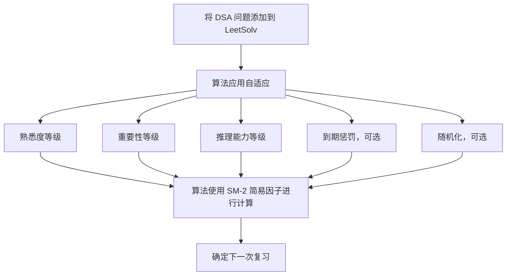
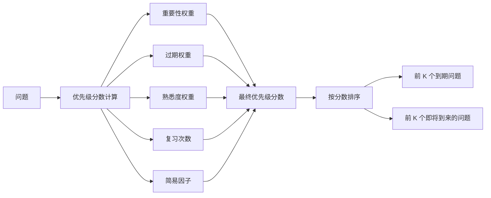
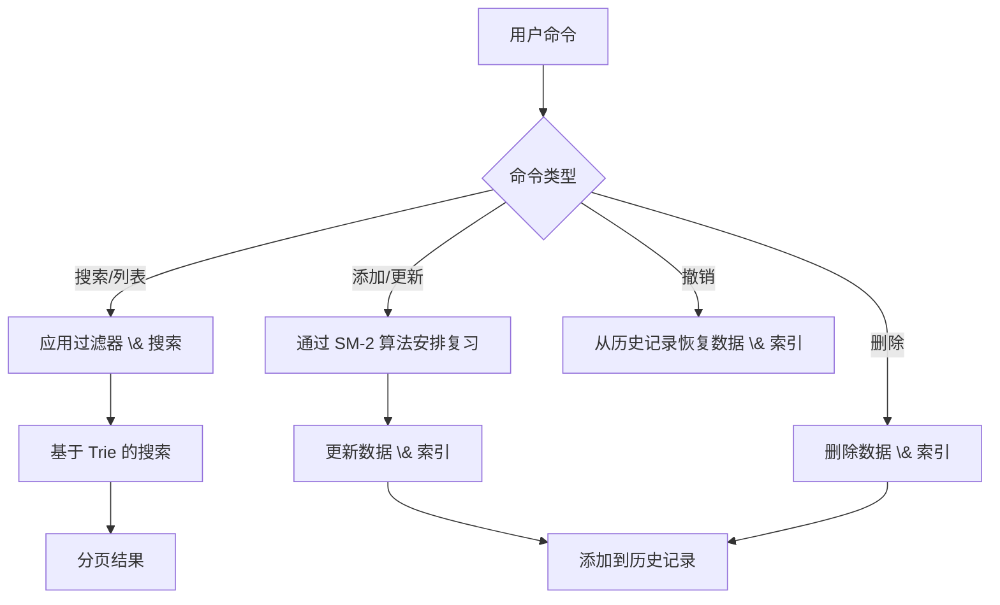

[English](./README.md) | [繁體中文](./README.zh-TW.md) | [简体中文](./README.zh-CN.md)

# LeetSolv

**LeetSolv** 是一个命令行工具，专为 **数据结构与算法 (DSA)** 问题复习而设计。它由一个定制的 [SuperMemo 2](https://en.wikipedia.org/wiki/SuperMemo) 算法驱动，该算法结合了诸如 **熟悉度**、**重要性** 和 **推理** 等变量。这种独特的方法超越了死记硬背，通过 **刻意练习** 帮助你 **掌握** 复杂的算法。

> ***0️⃣ 零依赖哲学**: 完全用纯 Go 实现，不使用第三方库、API 或外部工具。甚至避免使用一些标准包，以便完全控制底层实现——突出了项目对基础的关注。有关更多详细信息，请参阅 [MOTIVATION.md](document/MOTIVATION.md)*。

**LeetSolv 工作流程：**

下图说明了有效使用 LeetSolv 的推荐每日工作流程。


## 目录
- [LeetSolv](#leetsolv)
  - [目录](#目录)
  - [快速安装](#快速安装)
    - [自动安装 (Linux/macOS)](#自动安装-linuxmacos)
    - [手动下载 (所有平台)](#手动下载-所有平台)
    - [验证安装](#验证安装)
  - [复习调度系统](#复习调度系统)
    - [自适应 SM-2 算法](#自适应-sm-2-算法)
    - [到期优先级评分](#到期优先级评分)
    - [间隔增长曲线](#间隔增长曲线)
  - [问题管理](#问题管理)
    - [CRUD + 撤销](#crud--撤销)
    - [数据隐私 \& 安全](#数据隐私--安全)
    - [CLI 界面](#cli-界面)
  - [用法](#用法)
    - [交互模式](#交互模式)
    - [命令行模式](#命令行模式)
    - [可用命令](#可用命令)
    - [搜索命令过滤器](#搜索命令过滤器)
  - [配置](#配置)
    - [文件路径](#文件路径)
    - [SM-2 算法设置](#sm-2-算法设置)
    - [到期优先级评分设置](#到期优先级评分设置)
    - [其他设置](#其他设置)
    - [示例：环境变量](#示例环境变量)
    - [示例：JSON 设置文件](#示例json-设置文件)
  - [路线图](#路线图)
    - [安装 \& 运行](#安装--运行)
    - [功能](#功能)
    - [文档](#文档)
  - [许可证](#许可证)
  - [支持](#支持)
    - [常见问题解答](#常见问题解答)
      - [问：我应该添加所有以前解决过的问题吗？](#问我应该添加所有以前解决过的问题吗)
      - [问：使用一段时间后，我积累了太多到期问题。](#问使用一段时间后我积累了太多到期问题)
    - [文档](#文档-1)
    - [链接](#链接)

## 快速安装

### 自动安装 (Linux/macOS)
```bash
# 下载并运行安装脚本
curl -fsSL https://raw.githubusercontent.com/eannchen/leetsolv/main/install.sh | bash

# 或者先下载，然后运行
wget https://raw.githubusercontent.com/eannchen/leetsolv/main/install.sh
chmod +x install.sh
./install.sh
```

### 手动下载 (所有平台)
1. 转到 [Releases](https://github.com/eannchen/leetsolv/releases)
2. 下载适用于您平台的二进制文件：
   - **Linux**: `leetsolv-linux-amd64` 或 `leetsolv-linux-arm64`
   - **macOS**: `leetsolv-darwin-amd64` 或 `leetsolv-darwin-arm64`
   - **Windows**: `leetsolv-windows-amd64.exe` 或 `leetsolv-windows-arm64.exe`

### 验证安装
```bash
leetsolv version
leetsolv help
```

> *有关详细的安装和配置说明，请参阅 [INSTALL.md](document/INSTALL.md)*

## 复习调度系统

### 自适应 SM-2 算法

添加问题时，LeetSolv 应用具有自定义因素（**熟悉度**、**重要性** 和 **推理能力**）的 SM-2 算法来使用简易因子计算下一个复习日期。

- **简易因子**：经典 SM-2 算法中用于计算下一个复习间隔的决定因素。
- **熟悉度等级**：5 级熟悉度评估（`VeryHard`、`Hard`、`Medium`、`Easy`、`VeryEasy`）用于个人评级。
- **重要性等级**：4 层优先级系统（`Low`、`Medium`、`High`、`Critical`）用于问题优先级排序。
- **推理能力等级**：3 级记忆评估（`Reasoned`、`Partial`、`Full recall`），对较弱的推理能力进行惩罚。这种设计强化了通过推理而不是死记硬背来掌握数据结构和算法的目标。
- **到期惩罚（可选）**：对过期复习问题进行自动惩罚的系统。
- **随机化（可选）**：随机调度变化以防止日期过度拟合。



> *点击此处了解有关该算法的更多信息：[间隔增长曲线](#间隔增长曲线)*

### 到期优先级评分
使用 SM-2，到期复习很容易累积，因为用户有不同的时间表和学习习惯。为了应对这一挑战，LeetSolv 引入了到期优先级评分功能，该功能**允许用户根据优先级分数对到期问题进行优先级排序**。

- **多因素评分**：重要性、熟悉度、过期天数、复习次数和简易因子的组合决定了到期优先级。



> *默认情况下，优先级分数使用以下公式计算：(1.5×重要性)+(0.5×过期天数)+(3.0×熟悉度)+(-1.5×复习次数)+(-1.0×简易因子)*

**到期优先级列表演示：**


### 间隔增长曲线

LeetSolv 根据重要性、熟悉度和推理能力调整 SM-2 间隔。**重要问题会更频繁地复习，而简单的问题的间隔会逐渐变长。**

以下图表演示了不同重要性级别的问题的复习间隔如何随时间增长，显示了默认的增长模式：


**关键问题**：最短的间隔，频繁的复习，以确保掌握最重要的概念。


**高重要性**：适度的间隔，平衡了频率和效率，适用于重要问题。


**中等重要性**：标准间隔，遵循经典的 SM-2 进展，适用于常规练习。


**低重要性**：较长的间隔，适用于需要较少复习的问题。

> *未来的迭代可能会允许直接在配置文件中修改算法参数。*

## 问题管理

### CRUD + 撤销
- **摘要视图**：总问题、到期问题和即将到来的问题的概述，带有 [优先级评分](#到期优先级评分)。
- **列表视图**：列出所有问题，带有分页。
- **基于 Trie 的搜索和过滤**：通过关键字、熟悉度、重要性、复习次数和到期状态进行快速搜索和过滤。
- **获取问题详细信息**：检索有关特定问题的详细信息。
- **添加/更新问题**：创建或修改问题，带有 URL 和注释。
- **删除问题**：按 ID 和 URL 删除问题。
- **历史记录 \& 撤销**：跟踪更改并恢复最近的操作。



**搜索、历史记录、删除、撤销功能演示：**


### 数据隐私 \& 安全

- **无数据收集**：LeetSolv 不会将用户数据上传到互联网。
- **原子写入**：所有更新都使用带有原子替换的临时文件，以保证一致性并防止数据丢失。


### CLI 界面
- **交互模式**：用户和程序之间的回合制对话。
- **批处理模式**：直接从命令行执行命令。
- **别名支持**：方便的直观快捷方式（例如，`ls`、`rm`、`cfg`）。
- **分页**：高效导航大型问题集。
- **清晰的输出**：结构化的、颜色编码的 CLI 输出。

**分页演示：**


## 用法

### 交互模式
```bash
# 启动交互式会话
leetsolv

# 你会看到提示：
leetsolv ❯
```

### 命令行模式
```bash
# 列出所有问题
leetsolv list

# 使用过滤器搜索问题
leetsolv search tree --familiarity=3 --importance=2 --due-only

# 获取问题详细信息
leetsolv detail 123

# 检查状态
leetsolv status

# 添加新问题
leetsolv add https://leetcode.com/problems/example
```

### 可用命令

| 命令      | 别名                  | 描述                           |
| --------- | --------------------- | ------------------------------ |
| `list`    | `ls`                  | 列出所有问题，带有分页         |
| `search`  | `s`                   | 按关键字搜索问题（支持过滤器） |
| `detail`  | `get`                 | 获取有关问题的详细信息         |
| `status`  | `stat`                | 显示到期和即将到来的问题的摘要 |
| `upsert`  | `add`                 | 添加或更新问题                 |
| `remove`  | `rm`, `delete`, `del` | 删除问题                       |
| `undo`    | `back`                | 撤销上次操作                   |
| `history` | `hist`, `log`         | 显示操作历史记录               |
| `setting` | `config`, `cfg`       | 查看和修改应用程序设置         |
| `version` | `ver`, `v`            | 显示应用程序版本信息           |
| `help`    | `h`                   | 显示帮助信息                   |
| `clear`   | `cls`                 | 清除屏幕                       |
| `quit`    | `q`, `exit`           | 退出应用程序                   |

### 搜索命令过滤器

`search` 命令允许您按关键字（在 **URL** 或 **注释** 中）搜索，并使用过滤器优化结果。

**语法：**
```bash
search [keywords...] [filters...]
```

**过滤器：**

| 过滤器             | 描述                   |
| ------------------ | ---------------------- |
| `--familiarity=N`  | 按熟悉度等级过滤 (1-5) |
| `--importance=N`   | 按重要性等级过滤 (1-4) |
| `--review-count=N` | 按复习次数过滤         |
| `--due-only`       | 仅显示到期问题         |

## 配置

您可以通过两种方式配置 **LeetSolv**：

1. **环境变量** – 方便用于临时或部署级别的覆盖。
2. **JSON 设置文件** (`$HOME/.leetsolv/settings.json`) – 您可以手动编辑的持久配置。

两种方法都映射到相同的内部配置。
- 环境变量遵循 `UPPERCASE_SNAKE_CASE` 命名。
- JSON 字段遵循 `camelCase` 命名。

例如：
- 环境变量：`LEETSOLV_RANDOMIZE_INTERVAL=true`
- JSON：`"randomizeInterval": true`

如果两者都提供，则 **JSON 设置文件优先于** 环境变量。

### 文件路径

| 环境变量                  | JSON 字段       | 默认值                           | 描述             |
| ------------------------- | --------------- | -------------------------------- | ---------------- |
| `LEETSOLV_QUESTIONS_FILE` | `questionsFile` | `$HOME/.leetsolv/questions.json` | 问题数据文件     |
| `LEETSOLV_DELTAS_FILE`    | `deltasFile`    | `$HOME/.leetsolv/deltas.json`    | 更改历史记录文件 |
| `LEETSOLV_INFO_LOG_FILE`  | `infoLogFile`   | `$HOME/.leetsolv/info.log`       | 信息日志文件     |
| `LEETSOLV_ERROR_LOG_FILE` | `errorLogFile`  | `$HOME/.leetsolv/error.log`      | 错误日志文件     |
| `LEETSOLV_SETTINGS_FILE`  | `settingsFile`  | `$HOME/.leetsolv/settings.json`  | 配置 JSON 文件   |

### SM-2 算法设置

| 环境变量                      | JSON 字段           | 默认值  | 描述                   |
| ----------------------------- | ------------------- | ------- | ---------------------- |
| `LEETSOLV_RANDOMIZE_INTERVAL` | `randomizeInterval` | `true`  | 启用/禁用间隔随机化    |
| `LEETSOLV_OVERDUE_PENALTY`    | `overduePenalty`    | `false` | 启用/禁用过期惩罚系统  |
| `LEETSOLV_OVERDUE_LIMIT`      | `overdueLimit`      | `7`     | 过期问题受到惩罚的天数 |

### 到期优先级评分设置

| 环境变量                         | JSON 字段             | 默认值 | 描述                          |
| -------------------------------- | --------------------- | ------ | ----------------------------- |
| `LEETSOLV_TOP_K_DUE`             | `topKDue`             | `10`   | 要显示的前 K 个到期问题       |
| `LEETSOLV_TOP_K_UPCOMING`        | `topKUpcoming`        | `10`   | 要显示的前 K 个即将到来的问题 |
| `LEETSOLV_IMPORTANCE_WEIGHT`     | `importanceWeight`    | `1.5`  | 问题重要性的权重              |
| `LEETSOLV_OVERDUE_WEIGHT`        | `overdueWeight`       | `0.5`  | 过期问题的权重                |
| `LEETSOLV_FAMILIARITY_WEIGHT`    | `familiarityWeight`   | `3.0`  | 熟悉度等级的权重              |
| `LEETSOLV_REVIEW_PENALTY_WEIGHT` | `reviewPenaltyWeight` | `-1.5` | 高复习次数的惩罚              |
| `LEETSOLV_EASE_PENALTY_WEIGHT`   | `easePenaltyWeight`   | `-1.0` | 简单问题的惩罚                |

### 其他设置

| 环境变量             | JSON 字段  | 默认值 | 描述               |
| -------------------- | ---------- | ------ | ------------------ |
| `LEETSOLV_PAGE_SIZE` | `pageSize` | `5`    | 每页的问题数       |
| `LEETSOLV_MAX_DELTA` | `maxDelta` | `50`   | 最大历史记录条目数 |

### 示例：环境变量

```bash
export LEETSOLV_RANDOMIZE_INTERVAL=false
export LEETSOLV_PAGE_SIZE=20
```

### 示例：JSON 设置文件

```json
{
    "randomizeInterval": false,
    "pageSize": 20
}
```

## 路线图

### 安装 \& 运行

- 支持通过包管理器（Homebrew、Chocolatey、apt）安装
- 支持作为 Docker 容器运行
- 支持自动更新程序功能
- 添加 Windows 安装脚本

### 功能

- 提供标记功能
- 提供导出功能
- 添加对来自其他平台的 DSA 问题的支持
- 使 SM-2 算法用户可自定义
- 实现模糊搜索功能

### 文档

- 编写多语言文档

## 许可证

本项目根据 [LICENSE](LICENSE) 文件中指定的条款获得许可。

## 支持

### 常见问题解答

#### 问：我应该添加所有以前解决过的问题吗？

答：**不应该。** LeetSolv 不是一个已解决问题的数据库，而是一个间隔重复调度器。
只添加你真正想要复习的问题。调度算法依赖于你添加问题的日期来计算复习时间，所以批量添加会创建一个不切实际的计划，并产生大量到期问题。

👉 提示：如果你想复习几个月前解决的一个旧问题，先重新解决它，然后在当天将其添加到 LeetSolv。这样，“上次查看”日期才是准确的。

#### 问：使用一段时间后，我积累了太多到期问题。

答：这是 **SM-2 算法** 的本质——如果你跳过几天或一次添加许多问题，到期列表可能会迅速增长。
为了使其易于管理，LeetSolv 引入了 **[到期优先级评分](#due-priority-scoring)**，它按重要性、熟悉度、逾期天数、复习次数和容易程度对到期问题进行排名。
不要一次性清除所有内容，只需专注于**最高优先级的问题**。其余的可以安全地等到以后。

👉 提示：一旦你掌握了一个问题并重新解决了它几次，你就可以安全地将其从 LeetSolv 中删除。目标不是永远跟踪一切，而是专注于仍然需要间隔练习的问题。


### 文档
- **[INSTALL.md](document/INSTALL.md)**：完整的安装指南，包含故障排除
- **[DEVELOPMENT_GUIDE.md](document/DEVELOPMENT_GUIDE.md)**：开发工作流程、CI/CD 和贡献指南
- **[MOTIVATION.md](document/MOTIVATION.md)**：项目动机和设计说明
- **此 README**：项目概述和快速入门

### 链接
- **问题**：[GitHub Issues](https://github.com/eannchen/leetsolv/issues)
- **讨论**：[GitHub Discussions](https://github.com/eannchen/leetsolv/discussions)
- **发布**：[GitHub Releases](https://github.com/eannchen/leetsolv/releases)

---

**LeetSolv** - 一款用于数据结构与算法问题复习的 CLI 工具，由自定义 SM-2 算法驱动，通过刻意练习帮助你掌握算法。
