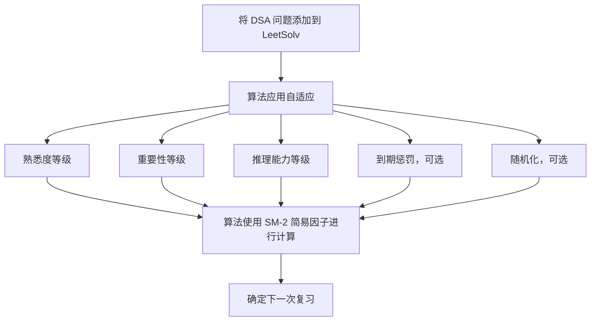

[English](./README.md) | [繁體中文](./README.zh-TW.md) | [简体中文](./README.zh-CN.md)

# LeetSolv
[](https://github.com/eannchen/leetsolv/releases)
[](https://goreportcard.com/report/github.com/eannchen/leetsolv)
[](https://github.com/eannchen/leetsolv/actions/workflows/ci.yml)

**LeetSolv** 是一个命令行工具，专为 **数据结构与算法 (DSA)** 问题复习而设计，带有 **间隔重复 (spaced repetition)** 功能。支持 [LeetCode](https://leetcode.com) 和 [HackerRank](https://hackerrank.com) 平台的题目。它由一个定制的 [SuperMemo 2](https://en.wikipedia.org/wiki/SuperMemo) 算法驱动，该算法结合了 **熟悉度**、**重要性** 和 **推理** 等变量，避免死记硬背。

> ***零依赖**: 完全用纯 Go 实现，不使用第三方库或外部工具——完全控制底层实现。详见 [MOTIVATION.md](document/MOTIVATION.md)。*


## 目录
- [LeetSolv](#leetsolv)
  - [目录](#目录)
  - [快速安装](#快速安装)
    - [Scoop (Windows)](#scoop-windows)
    - [Homebrew (macOS/Linux)](#homebrew-macoslinux)
    - [Shell Script (macOS/Linux)](#shell-script-macoslinux)
    - [验证安装](#验证安装)
  - [复习调度系统](#复习调度系统)
    - [自适应 SM-2 算法](#自适应-sm-2-算法)
    - [到期优先级评分](#到期优先级评分)
    - [间隔增长曲线](#间隔增长曲线)
  - [问题管理](#问题管理)
    - [功能](#功能)
    - [数据隐私 \& 安全](#数据隐私--安全)
  - [用法](#用法)
  - [配置](#配置)
  - [支持](#支持)
    - [常见问题解答](#常见问题解答)
      - [问：为什么要使用 LeetSolv 而不是 Anki 卡片？](#问为什么要使用-leetsolv-而不是-anki-卡片)
      - [问：我应该添加所有以前解决过的问题吗？](#问我应该添加所有以前解决过的问题吗)
      - [问：使用一段时间后，我积累了太多到期问题。](#问使用一段时间后我积累了太多到期问题)
    - [文档](#文档)
  - [发展规划](#发展规划)

## 快速安装

### Scoop (Windows)

```powershell
scoop bucket add eannchen https://github.com/eannchen/scoop-bucket
scoop install leetsolv
```

### Homebrew (macOS/Linux)

```bash
brew tap eannchen/tap
brew install leetsolv
```

### Shell Script (macOS/Linux)

下载并运行安装脚本

```bash
curl -fsSL https://raw.githubusercontent.com/eannchen/leetsolv/main/install.sh | bash
```

### 验证安装
```bash
leetsolv version
leetsolv help
```

## 复习调度系统

### 自适应 SM-2 算法

与标准 SM-2（Anki 使用）不同，LeetSolv 增加了 **重要性** 和 **推理** 因子——专为 DSA 练习设计，而非卡片记忆。熟悉度（5 级）、重要性（4 级）和推理（3 级）决定下次复习日期。随机化防止复习集中在同一天。



### 到期优先级评分
到期复习会随时间累积。LeetSolv 按优先级分数排序，让你专注于最重要的问题。

> *默认公式：(1.5×重要性) + (0.5×过期天数) + (3.0×熟悉度) + (-1.5×复习次数) + (-1.0×简易因子)*


### 间隔增长曲线

复习间隔根据重要性、熟悉度和推理能力扩展。重要性越高 = 间隔越短，复习越频繁。


## 问题管理

### 功能

- **CRUD + 撤销**：创建、查看、更新、删除问题。撤销上一个操作。
- **Trie 搜索**：按关键字、重要性、熟悉度快速过滤。
- **快速视图**：到期/即将到期问题摘要，分页列表。
- **交互式和批处理模式**：交互式运行或直接传递命令。
- **直观命令**：熟悉的别名（`ls`、`rm`），彩色输出。


### 数据隐私 & 安全

- **无数据收集**：LeetSolv 不会将用户数据上传到互联网。
- **原子写入**：所有写入使用临时文件 + 重命名，保证数据一致性。

## 用法

LeetSolv 可以交互式运行，也可以直接从终端传递命令来运行。

```bash
# 启动交互模式
leetsolv

# 或者直接运行命令
leetsolv add https://leetcode.com/problems/two-sum
leetsolv status

# 获取帮助
leetsolv help
```

[查看完整使用指南 (USAGE.md)](document/USAGE.md)


## 配置

通过环境变量或 JSON 配置文件自定义。详见 [CONFIGURATION.md](document/CONFIGURATION.md)。

## 支持

### 常见问题解答

#### 问：为什么要使用 LeetSolv 而不是 Anki 卡片？

答：Anki 适合记忆事实，但 DSA 需要更深入的练习。LeetSolv 的 SM-2 算法使用推理、熟悉度和重要性来安排刻意的解题练习——而非死记硬背。

#### 问：我应该添加所有以前解决过的问题吗？

答：不。只添加你想复习的问题。算法使用添加日期来排程——批量添加会创建不切实际的计划。旧问题先重新解决，再添加。

#### 问：使用一段时间后，我积累了太多到期问题。

答：跳过几天后 SM-2 会累积到期问题。使用[到期优先级评分](#到期优先级评分)专注于高优先级问题。已掌握的问题可以删除——目标是持续练习，而非追踪所有内容。


### 文档
- [USAGE.md](document/USAGE.md) — 命令行使用
- [CONFIGURATION.md](document/CONFIGURATION.md) — 配置选项
- [MOTIVATION.md](document/MOTIVATION.md) — 设计理念

## 发展规划

- 标记功能

[提出建议](https://github.com/eannchen/leetsolv/issues)

---

**LeetSolv** - 基于自定义 SM-2 算法的 DSA 间隔重复 CLI 工具，助你刻意练习。
