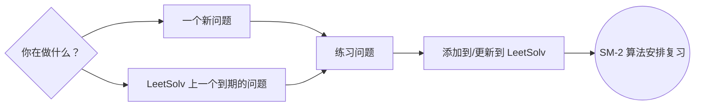
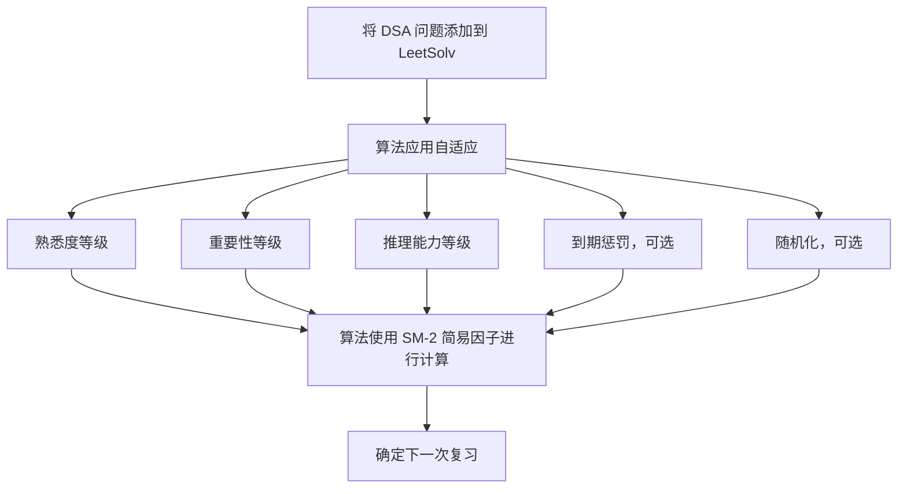
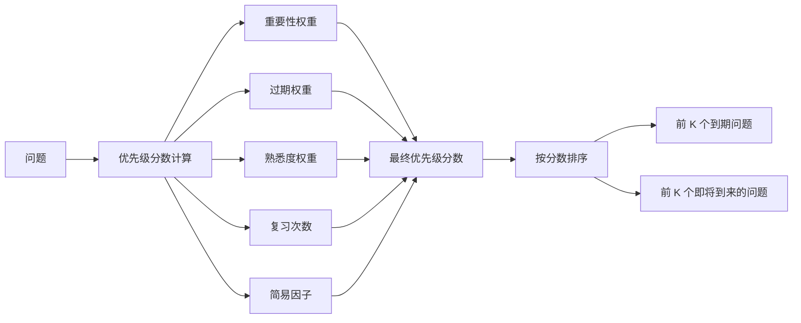
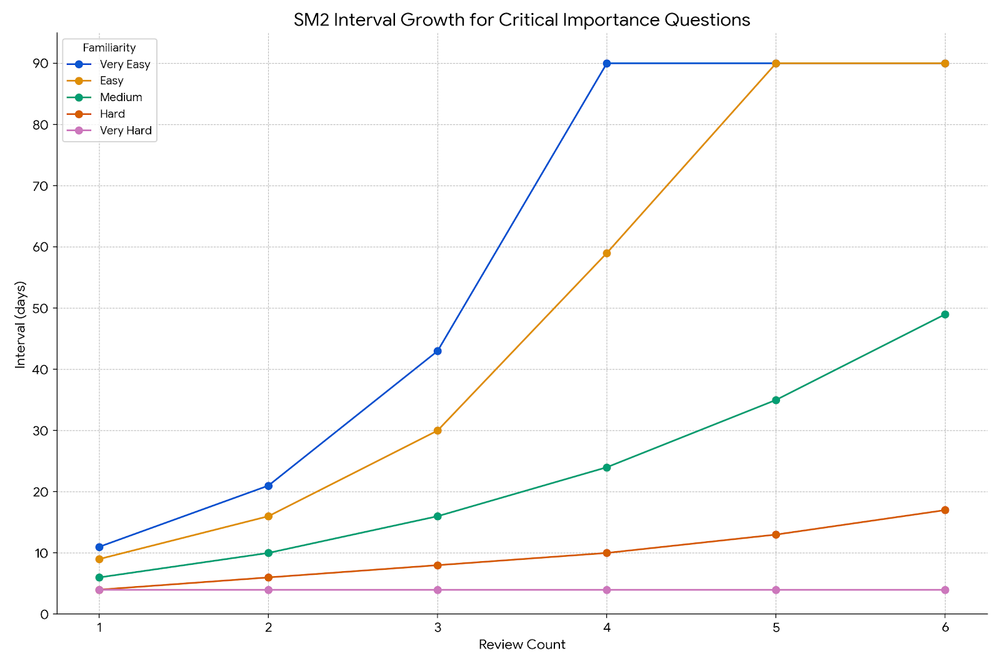
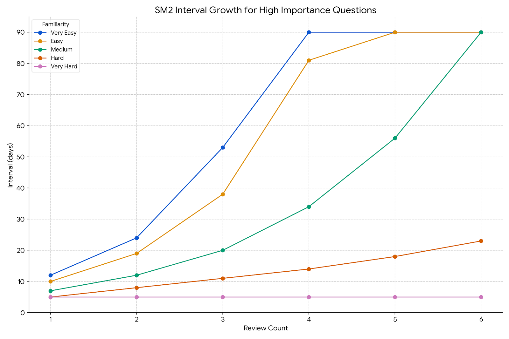
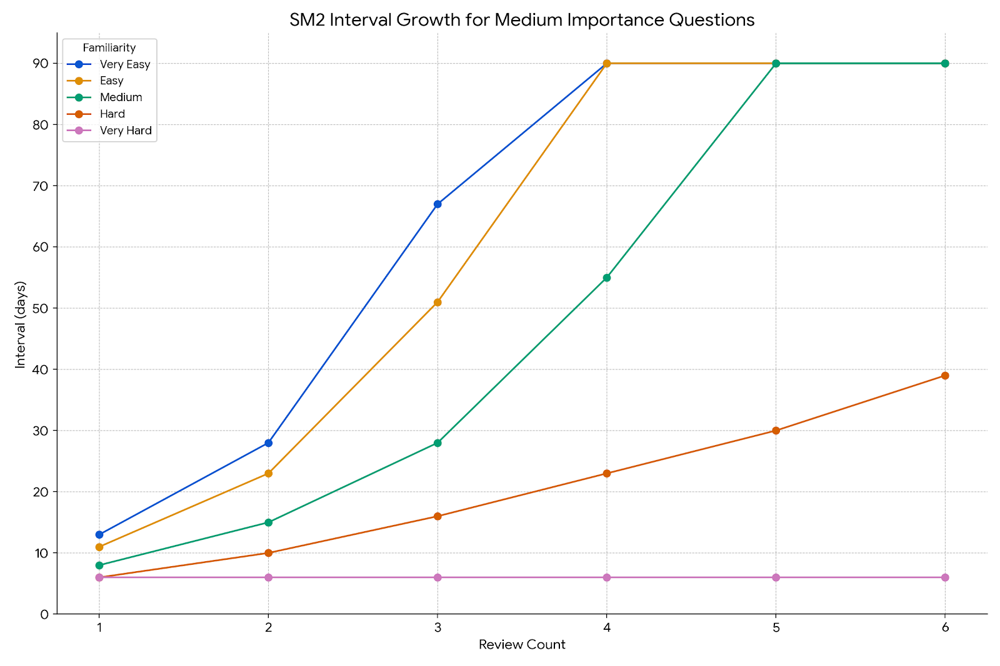
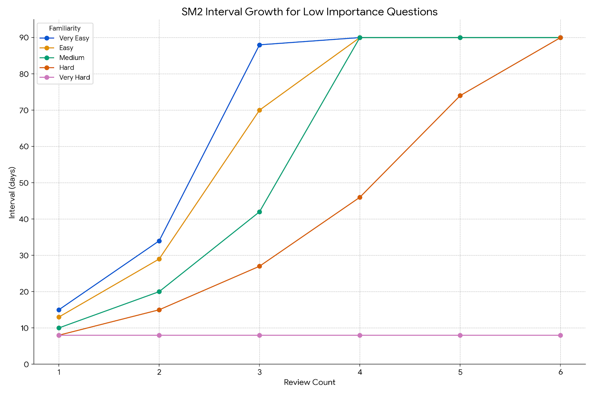
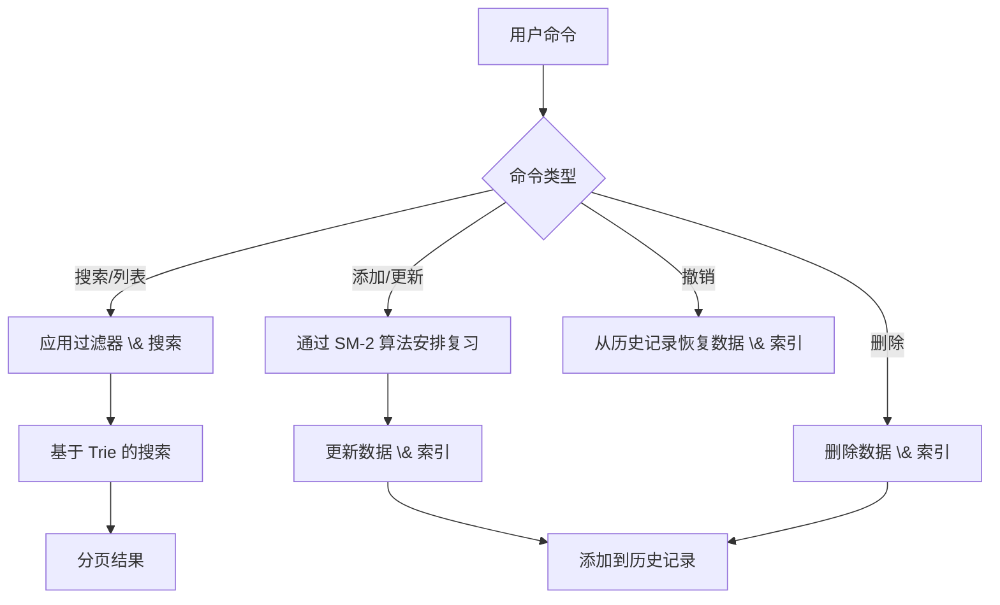
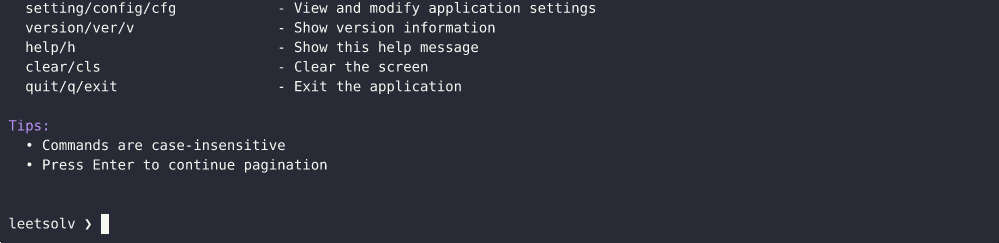

[English](./README.md) | [繁體中文](./README.zh-TW.md) | [简体中文](./README.zh-CN.md)

# LeetSolv
[](https://github.com/eannchen/leetsolv/releases)
[](https://goreportcard.com/report/github.com/eannchen/leetsolv)
[](https://github.com/eannchen/leetsolv/actions/workflows/ci.yml)

**LeetSolv** 是一个命令行工具，专为 **数据结构与算法 (DSA)** 问题复习而设计，带有 **间隔重复 (spaced repetition)** 功能。它由一个定制的 [SuperMemo 2](https://en.wikipedia.org/wiki/SuperMemo) 算法驱动，该算法结合了诸如 **熟悉度**、**重要性** 和 **推理** 等变量。这个方法避免了死记硬背，通过 **刻意练习** 帮助你掌握复杂的算法。

*想知道这与 Anki 这样的工具有什么不同吗？请参阅 [支持](#支持)。*

> ***0️⃣ 零依赖哲学**: 完全用纯 Go 实现，不使用第三方库、API 或外部工具。甚至避免使用一些标准包，以便完全控制底层实现——突出了项目对基础的关注。有关更多详细信息，请参阅 [MOTIVATION.md](document/MOTIVATION.md)*。

**LeetSolv 工作流程：**

下图说明了有效使用 LeetSolv 的推荐每日工作流程。




## 目录
- [LeetSolv](#leetsolv)
  - [目录](#目录)
  - [快速安装](#快速安装)
    - [自动安装 (Linux/macOS)](#自动安装-linuxmacos)
    - [手动下载 (所有平台)](#手动下载-所有平台)
    - [验证安装](#验证安装)
  - [复习调度系统](#复习调度系统)
    - [自适应 SM-2 算法](#自适应-sm-2-算法)
    - [到期优先级评分](#到期优先级评分)
    - [间隔增长曲线](#间隔增长曲线)
  - [问题管理](#问题管理)
    - [核心功能](#核心功能)
    - [数据隐私 \& 安全](#数据隐私--安全)
    - [CLI 界面](#cli-界面)
  - [用法](#用法)
  - [配置](#配置)
  - [支持](#支持)
    - [常见问题解答](#常见问题解答)
      - [问：为什么要使用 LeetSolv 而不是 Anki 卡片？](#问为什么要使用-leetsolv-而不是-anki-卡片)
      - [问：我应该添加所有以前解决过的问题吗？](#问我应该添加所有以前解决过的问题吗)
      - [问：使用一段时间后，我积累了太多到期问题。](#问使用一段时间后我积累了太多到期问题)
    - [文档](#文档)
  - [发展规划](#发展规划)
    - [自适应 SM-2 算法](#自适应-sm-2-算法-1)
    - [安装 \& 运行](#安装--运行)
    - [功能](#功能)
  - [许可证](#许可证)

## 快速安装

### 自动安装 (Linux/macOS)

下载并运行安装脚本

```bash
curl -fsSL https://raw.githubusercontent.com/eannchen/leetsolv/main/install.sh | bash
```

> *[未来规划](#发展规划)支持 Windows 自动安装。*

### 手动下载 (所有平台)
1. 转到 [Releases](https://github.com/eannchen/leetsolv/releases)
2. 下载适用于您平台的二进制文件：
   - **Linux**: `leetsolv-linux-amd64` 或 `leetsolv-linux-arm64`
   - **macOS**: `leetsolv-darwin-amd64` 或 `leetsolv-darwin-arm64`
   - **Windows**: `leetsolv-windows-amd64.exe` 或 `leetsolv-windows-arm64.exe`

> *有关详细的安装说明，请参阅 [INSTALL.md](document/INSTALL.md)*

### 验证安装
```bash
leetsolv version
leetsolv help
```

## 复习调度系统

### 自适应 SM-2 算法

当添加问题时，LeetSolv 应用具有自定义因素（**熟悉度**、**重要性** 和 **推理**）的 SM-2 算法来计算下一个复习日期。这种设计强化了**通过推理而不是死记硬背**来掌握数据结构和算法的目标。



> *点击此处了解有关该算法的更多信息：[间隔增长曲线](#间隔增长曲线)*

### 到期优先级评分
使用 SM-2，到期复习很容易累积，因为用户有不同的时间表和学习习惯。为了应对这一挑战，LeetSolv 引入了到期优先级评分功能，该功能**允许用户根据优先级分数对到期问题进行优先级排序**。



> *默认情况下，优先级分数使用以下公式计算：(1.5×重要性)+(0.5×过期天数)+(3.0×熟悉度)+(-1.5×复习次数)+(-1.0×简易因子)*

**到期优先级列表演示：**


### 间隔增长曲线

该系统可以帮助您确定问题的优先级，并有效地管理您的复习计划，即使学习时间有限。

您的**复习间隔**会根据问题的**重要性**自动设置。然后，此间隔会随着时间的推移而扩大，根据您对问题的**熟悉程度**和**推理**水平而变化。

这意味着您可以：

- **打下坚实的基础**：优先考虑 *NeetCode Blind 75* 或 *NeetCode 150* 来打下基础，并使用 *NeetCode 250* 进行额外练习。
- **瞄准特定目标**：优先考虑来自公司特定列表的问题，以备即将到来的面试。

**重要问题会更频繁地复习，而较不重要的问题会获得更长的间隔。**

以下图表演示了不同重要性级别的问题的复习间隔如何随时间增长，显示了默认的增长模式：


**关键问题**：最短的间隔，频繁的复习，以确保掌握最重要的概念。


**高重要性**：适度的间隔，平衡复习频率，适用于重要问题。


**中等重要性**：标准间隔，适用于常规练习。


**低重要性**：较长的间隔，适用于需要较少复习的问题。

> *[未来的迭代](#发展规划)可能会允许直接在配置文件中修改算法参数。*

## 问题管理

### 核心功能

- **CRUD + 撤销**：轻松**创建**、**查看**、**更新**和**删除**您的问题。您还可以**撤销**您的上一个操作。
- **基于 Trie 的搜索**：通过关键字、重要性、熟悉度等，使用**极速搜索和过滤**立即找到问题。
- **快速视图**：获取所有问题的**摘要**，包括即将到期的问题，或查看完整的**分页列表**。



**搜索、历史记录、删除、撤销功能演示：**


### 数据隐私 \& 安全

- **无数据收集**：LeetSolv 不会将用户数据上传到互联网。
- **原子写入**：所有更新都使用带有原子替换的临时文件，以**保证一致性**并**防止数据丢失**。


### CLI 界面
- **交互式和批处理模式**：在**基于回合的交互式模式**下工作，或运行**直接命令**以进行快速操作。
- **直观的命令**：使用熟悉的别名（如 `ls`、`rm`），并获得**颜色编码的输出**，以获得清晰愉悦的体验。


**分页演示：**


## 用法

LeetSolv 可以交互式运行，也可以直接从终端传递命令来运行。

```bash
# 启动交互模式
leetsolv

# 或者直接运行命令
leetsolv add https://leetcode.com/problems/two-sum
leetsolv status

# 获取帮助
leetsolv help
```

[查看完整使用指南 (USAGE.md)](document/USAGE.md)


## 配置

LeetSolv 可以使用环境变量或 JSON 设置文件进行自定义。这允许您更改文件路径、算法参数和评分权重。

有关所有可用选项、默认值和示例的完整列表，请参阅详细的配置指南：

[查看完整配置指南 (CONFIGURATION.md)](document/CONFIGURATION.md)

## 支持

### 常见问题解答

#### 问：为什么要使用 LeetSolv 而不是 Anki 卡片？

答：Anki 非常适合**记忆几秒钟就能完成的事实**，**但对于 DSA 来说，它可能会适得其反**。LeetSolv 的自定义 SM-2 算法 **延长** 间隔复习时间，并使用您对**推理**、**熟悉度**和问题**重要性**的输入来创建一个时间表，从而加深您解决问题的能力，而不仅仅是检查您是否记住了答案。

👉 提示：Anki 适合用来记忆事实，而 LeetSolv 则是用来安排深度、刻意的解题练习。

#### 问：我应该添加所有以前解决过的问题吗？

答：**不应该。** LeetSolv 不是一个已解决问题的数据库，而是一个间隔重复调度器。
只添加你真正想要复习的问题。调度算法依赖于你添加问题的日期来计算复习时间，所以批量添加会创建一个不切实际的计划，并产生大量到期问题。

👉 提示：如果你想复习几个月前解决的一个旧问题，先重新解决它，然后在当天将其添加到 LeetSolv。这样，“上次查看”日期才是准确的。

#### 问：使用一段时间后，我积累了太多到期问题。

答：这是SM-2 算法的**本质**——如果你跳过几天或一次添加许多问题，到期列表可能会迅速增长。
为了使其易于管理，LeetSolv 引入了 **[到期优先级评分](#到期优先级评分)**，它按重要性、熟悉度、逾期天数、复习次数和容易程度对到期问题进行排名。
不要一次性清除所有内容，只需专注于**最高优先级的问题**。其余的可以安全地等到以后。

👉 提示：一旦你掌握了一个问题并重新解决了它几次，你就可以安全地将其从 LeetSolv 中删除。目标不是永远跟踪一切，而是专注于仍然需要间隔练习的问题。


### 文档
- **[INSTALL.md](document/INSTALL.md)**：完整的安装指南，包含故障排除
- **[USAGE.md](document/USAGE.md)**：命令行使用指南
- **[CONFIGURATION.md](document/CONFIGURATION.md)**：配置选项和环境变量
- **[DEVELOPMENT_GUIDE.md](document/DEVELOPMENT_GUIDE.md)**：开发工作流程、CI/CD 和贡献指南
- **[MOTIVATION.md](document/MOTIVATION.md)**：项目动机和设计说明
- **[ALGORITHM_ROADMAP.md](document/ALGORITHM_ROADMAP.md)**：算法开发规划
- **此 README**：项目概述和快速入门

## 发展规划

我们的发展规划是以使 LeetSolv 成为刻意练习的强大工具为目标。有什么建议吗？请随时[提出问题](https://github.com/eannchen/leetsolv/issues)！

### 自适应 SM-2 算法

- 分离 `熟悉度` 为 `推理熟悉度` 和 `编码熟悉度`
  - 阅读 [ALGORITHM_ROADMAP.md](document/ALGORITHM_ROADMAP.md) 获取更多细节
- 使 SM-2 算法用户可自定义

### 安装 \& 运行

- 支持通过包管理器（Homebrew、Chocolatey、apt）安装
- 支持作为 Docker 容器运行
- 支持自动更新程序功能
- 添加 Windows 安装脚本

### 功能

- 在问题条目中提供「提示」栏位
- 提供每日新增限制功能
- 提供标记功能
- 提供导出功能
- 添加对来自其他平台的 DSA 问题的支持
- 实现模糊搜索功能

## 许可证

本项目根据 [LICENSE](LICENSE) 文件中指定的条款获得许可。

---

**LeetSolv** - 一个基于自定义 SM-2 算法的 DSA 间隔重复 CLI 工具，帮助你通过刻意练习掌握算法。
