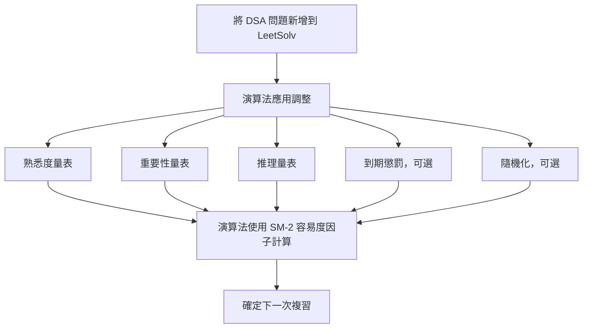

[English](./README.md) | [繁體中文](./README.zh-TW.md) | [简体中文](./README.zh-CN.md)

# LeetSolv
[](https://github.com/eannchen/leetsolv/releases)
[](https://goreportcard.com/report/github.com/eannchen/leetsolv)
[](https://github.com/eannchen/leetsolv/actions/workflows/ci.yml)

**LeetSolv** 是一個命令列工具，專為 **資料結構與演算法 (DSA)** 問題複習而設計，帶有 **間隔重複 (spaced repetition)** 功能。支援 [LeetCode](https://leetcode.com) 和 [HackerRank](https://hackerrank.com) 平台的題目。它由一個客製化的 [SuperMemo 2](https://en.wikipedia.org/wiki/SuperMemo) 演算法驅動，該演算法結合了 **熟悉度**、**重要性** 和 **推理** 等變數，避免死記硬背。

> ***零依賴**: 完全用純 Go 語言實現，沒有第三方庫或外部工具——完全控制底層實現。詳見 [MOTIVATION.md](document/MOTIVATION.md)。*


## 目錄
- [LeetSolv](#leetsolv)
  - [目錄](#目錄)
  - [快速安裝](#快速安裝)
    - [Scoop (Windows)](#scoop-windows)
    - [Homebrew (macOS/Linux)](#homebrew-macoslinux)
    - [Shell Script (macOS/Linux)](#shell-script-macoslinux)
    - [驗證安裝](#驗證安裝)
  - [複習排程系統](#複習排程系統)
    - [自適應 SM-2 演算法](#自適應-sm-2-演算法)
    - [到期優先級評分](#到期優先級評分)
    - [間隔增長曲線](#間隔增長曲線)
  - [問題管理](#問題管理)
    - [功能](#功能)
    - [資料隱私 \& 安全](#資料隱私--安全)
  - [使用方法](#使用方法)
  - [配置](#配置)
  - [支援](#支援)
    - [常見問題](#常見問題)
      - [問：為什麼要使用 LeetSolv 而不是 Anki 卡片？](#問為什麼要使用-leetsolv-而不是-anki-卡片)
      - [問：我應該加入所有之前解決過的問題嗎？](#問我應該加入所有之前解決過的問題嗎)
      - [問：使用一段時間後，我累積了太多到期問題。](#問使用一段時間後我累積了太多到期問題)
    - [文件](#文件)
  - [發展規劃](#發展規劃)

## 快速安裝

### Scoop (Windows)

```powershell
scoop bucket add eannchen https://github.com/eannchen/scoop-bucket
scoop install leetsolv
```

### Homebrew (macOS/Linux)

```bash
brew tap eannchen/tap
brew install leetsolv
```

### Shell Script (macOS/Linux)

```bash
curl -fsSL https://raw.githubusercontent.com/eannchen/leetsolv/main/install.sh | bash
```

### 驗證安裝
```bash
leetsolv version
leetsolv help
```

## 複習排程系統

### 自適應 SM-2 演算法

與標準 SM-2（Anki 使用）不同，LeetSolv 增加了 **重要性** 和 **推理** 因子——專為 DSA 練習設計，而非卡片記憶。熟悉度（5 級）、重要性（4 級）和推理（3 級）決定下次複習日期。隨機化防止複習集中在同一天。



### 到期優先級評分
到期複習會隨時間累積。LeetSolv 按優先級分數排序，讓你專注於最重要的問題。

> *預設公式：(1.5×重要性) + (0.5×過期天數) + (3.0×熟悉度) + (-1.5×複習次數) + (-1.0×容易度因子)*


### 間隔增長曲線

複習間隔根據重要性、熟悉度和推理能力擴展。重要性越高 = 間隔越短，複習越頻繁。


## 問題管理

### 功能

- **CRUD + 復原**：建立、檢視、更新、刪除問題。復原上一個動作。
- **Trie 搜尋**：按關鍵字、重要性、熟悉度快速過濾。
- **快速檢視**：到期/即將到期問題摘要，分頁清單。
- **互動式與批次模式**：互動式執行或直接傳遞命令。
- **直觀命令**：熟悉的別名（`ls`、`rm`），彩色輸出。


### 資料隱私 & 安全

- **無資料收集**：LeetSolv 不會將用戶資料上傳到網際網路。
- **原子寫入**：所有寫入使用臨時檔案 + 重新命名，保證資料一致性。

## 使用方法

LeetSolv 可以互動方式執行，也可以直接從終端機傳遞命令來執行。

```bash
# 啟動互動模式
leetsolv

# 或直接執行命令
leetsolv add https://leetcode.com/problems/two-sum
leetsolv status

# 取得說明
leetsolv help
```

[檢視完整使用指南 (USAGE.md)](document/USAGE.md)

## 配置

透過環境變數或 JSON 設定檔自訂。詳見 [CONFIGURATION.md](document/CONFIGURATION.md)。

## 支援

### 常見問題

#### 問：為什麼要使用 LeetSolv 而不是 Anki 卡片？

答：Anki 適合記憶事實，但 DSA 需要更深入的練習。LeetSolv 的 SM-2 演算法使用推理、熟悉度和重要性來安排刻意的解題練習——而非死記硬背。

#### 問：我應該加入所有之前解決過的問題嗎？

答：不。只加入你想複習的問題。演算法使用加入日期來排程——大量加入會創建不切實際的排程。舊問題先重新解決，再加入。

#### 問：使用一段時間後，我累積了太多到期問題。

答：跳過幾天後 SM-2 會累積到期問題。使用[到期優先級評分](#到期優先級評分)專注於高優先級問題。已掌握的問題可以刪除——目標是持續練習，而非追蹤所有內容。


### 文件
- [USAGE.md](document/USAGE.md) — 命令列使用
- [CONFIGURATION.md](document/CONFIGURATION.md) — 配置選項
- [MOTIVATION.md](document/MOTIVATION.md) — 設計理念

## 發展規劃

- 標記功能

[提出建議](https://github.com/eannchen/leetsolv/issues)

---

**LeetSolv** - 基於自訂 SM-2 演算法的 DSA 間隔重複 CLI 工具，助你刻意練習。
