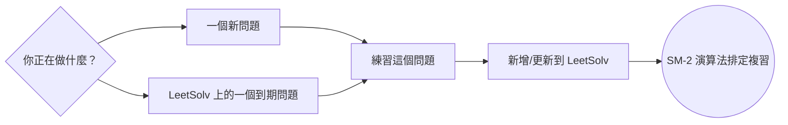
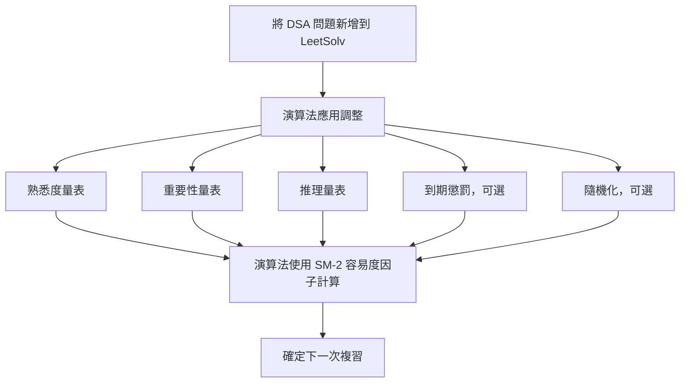
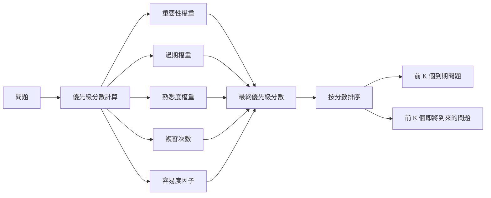
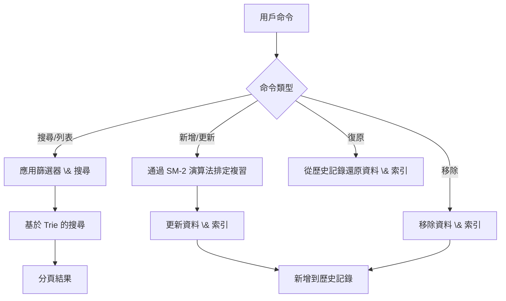

[English](./README.md) | [繁體中文](./README.zh-TW.md) | [简体中文](./README.zh-CN.md)

# LeetSolv
[](https://github.com/eannchen/leetsolv/releases)
[](https://goreportcard.com/report/github.com/eannchen/leetsolv)
[](https://github.com/eannchen/leetsolv/actions/workflows/ci.yml)

**LeetSolv** 是一個命令列工具，專為 **資料結構與演算法 (DSA)** 問題複習而設計，带有 **间隔重复 (spaced repetition)** 功能。支援 **[LeetCode](https://leetcode.com)** 和 **[HackerRank](https://hackerrank.com)** 平台的題目。它由一個客製化的 [SuperMemo 2](https://en.wikipedia.org/wiki/SuperMemo) 演算法驅動，該演算法結合了 **熟悉度**、**重要性** 和 **推理** 等變數。這個方法避免了死記硬背，透過 **刻意練習** 幫助您掌握複雜的演算法。

*想知道這與 Anki 之類的工具有何不同嗎？請參閱 [常見問題](#常見問題)。*

> ***0️⃣ 零依賴哲學**: 完全用純 Go 語言實現，沒有第三方庫、API 或外部工具。甚至避免使用一些標準套件，以便完全控制底層實現——突顯了該專案對基礎知識的關注。有關更多詳細資訊，請參閱 [MOTIVATION.md](document/MOTIVATION.md)*。

**LeetSolv 的工作流程：**

使用 LeetSolv 的建議每日工作流程。




## 目錄
- [LeetSolv](#leetsolv)
  - [目錄](#目錄)
  - [快速安裝](#快速安裝)
    - [Scoop (Windows)](#scoop-windows)
    - [Homebrew (macOS/Linux)](#homebrew-macoslinux)
    - [Shell Script (macOS/Linux)](#shell-script-macoslinux)
    - [驗證安裝](#驗證安裝)
  - [複習排程系統](#複習排程系統)
    - [自適應 SM-2 演算法](#自適應-sm-2-演算法)
    - [到期優先級評分](#到期優先級評分)
    - [間隔增長曲線](#間隔增長曲線)
  - [問題管理](#問題管理)
    - [核心功能](#核心功能)
    - [資料隱私 \& 安全](#資料隱私--安全)
    - [CLI 介面](#cli-介面)
  - [使用方法](#使用方法)
  - [配置](#配置)
  - [支援](#支援)
    - [常見問題](#常見問題)
      - [問：為什麼要使用 LeetSolv 而不是 Anki 卡片？](#問為什麼要使用-leetsolv-而不是-anki-卡片)
      - [問：我應該加入所有之前解決過的問題嗎？](#問我應該加入所有之前解決過的問題嗎)
      - [問：使用一段時間後，我累積了太多到期問題。](#問使用一段時間後我累積了太多到期問題)
    - [文件](#文件)
  - [發展規劃](#發展規劃)
    - [功能](#功能)

## 快速安裝

### Scoop (Windows)

```powershell
scoop bucket add eannchen https://github.com/eannchen/scoop-bucket
scoop install leetsolv
```

### Homebrew (macOS/Linux)

```bash
brew tap eannchen/tap
brew install leetsolv
```

### Shell Script (macOS/Linux)

```bash
curl -fsSL https://raw.githubusercontent.com/eannchen/leetsolv/main/install.sh | bash
```

### 驗證安裝
```bash
leetsolv version
leetsolv help
```

## 複習排程系統

### 自適應 SM-2 演算法

當新增問題時，LeetSolv 會應用自定義因子：**熟悉度 (5 個等級)**、**重要性 (4 個等級)** 和 **推理 (3 個等級)** 的 SM-2 演算法，以計算下一次複習日期。並採用**隨機化**因子避免了將複習集中到同一天。此設計**避免使用者使用記憶**，幫助扎實學習資料結構和演算法。



> *在此處查看以了解有關該演算法的更多資訊：[間隔增長曲線](#間隔增長曲線)*

### 到期優先級評分
使用 SM-2 時，由於用戶有不同的排程和學習習慣，因此到期複習很容易累積。為了應對這一挑戰，LeetSolv 引入了一種到期優先級評分功能，使用者可**根據分數優先複習最該複習的問題**。



> *預設情況下，優先級分數使用以下公式計算：(1.5×重要性)+(0.5×過期天數)+(3.0×熟悉度)+(-1.5×複習次數)+(-1.0×容易度因子)*

**到期優先級列表演示：**


### 間隔增長曲線

這個系統可以幫助您優先處理問題，並有效地管理您的複習進度，即使您的讀書時間有限。

您的**複習間隔**會根據問題的**重要性**自動設定。然後，這個間隔會隨著練習的進行而擴大，根據您對問題的**熟悉度**和**推理程度**而變化。

這表示您可以：

- **建立穩固的基礎**：優先處理 *NeetCode Blind 75* 或 *NeetCode 150* 以建立基礎，並使用 *NeetCode 250* 進行額外練習。
- **鎖定特定目標**：優先處理來自公司特定列表的問題，以應對即將到來的面試。


**重要問題會更頻繁地複習，而較不重要的問題會獲得更長的間隔。**

以下圖表展示了不同重要性級別的複習間隔如何隨時間增長，顯示了預設的增長模式：


**重要問題**：最短的間隔，頻繁的複習，以確保掌握最重要的概念。


**高重要性**：適度的間隔，平衡複習頻率，適用於重要問題。


**中等重要性**：標準間隔，適用於漸進式練習。


**低重要性**：較長的間隔，適用於不需要頻繁複習的問題。

> *[未來的更新](#發展規劃)可能會允許直接在配置文件中修改演算法參數。*

## 問題管理

### 核心功能

- **CRUD + 復原**：輕鬆**建立**、**檢視**、**更新**和**刪除**您的問題。您也可以**復原**您最後的動作。
- **基於 Trie 的搜尋**：透過關鍵字、重要性、熟悉度等，使用**極速搜尋和篩選**立即找到問題。
- **快速檢視**：取得所有問題的**摘要**，包括即將到期的問題，或檢視完整的**分頁清單**。



**搜尋、歷史記錄、刪除、復原功能演示：**


### 資料隱私 \& 安全

- **無資料收集**：LeetSolv 不會將用戶資料上傳到網際網路。
- **原子寫入**：所有更新都使用臨時檔案替換原始檔案，以**保證一致性**並**防止資料丟失**。


### CLI 介面

- **互動式與批次模式**：在**回合制互動模式**下工作，或執行**直接命令**以進行快速操作。
- **直觀的命令**：使用熟悉的別名，如 `ls`、`rm`，並獲得**顏色編碼的輸出**，以獲得清晰愉悅的體驗。

**分頁演示：**


## 使用方法

LeetSolv 可以互動方式執行，也可以直接從終端機傳遞命令來執行。

```bash
# 啟動互動模式
leetsolv

# 或直接執行命令
leetsolv add https://leetcode.com/problems/two-sum
leetsolv status

# 取得說明
leetsolv help
```

[檢視完整使用指南 (USAGE.md)](document/USAGE.md)

## 配置

LeetSolv 可以使用環境變數或 JSON 設定檔進行自訂。這允許您更改檔案路徑、演算法參數和評分權重。

如需所有可用選項、預設值和範例的完整清單，請參閱詳細的設定指南：

[檢視完整設定指南 (CONFIGURATION.md)](document/CONFIGURATION.md)

## 支援

### 常見問題

#### 問：為什麼要使用 LeetSolv 而不是 Anki 卡片？

答：Anki 非常適合**記憶幾秒鐘就能完成的事實**，**但對於 DSA 來說，它可能會適得其反**。LeetSolv 的自訂 SM-2 演算法 **延長** 間隔複習時間，並使用您對**推理**、**熟悉度**和問題**重要性**的輸入來建立一個加深您解決問題能力的排程，而不是僅僅檢查您是否記住了答案。

👉 提示：Anki 適合用來記憶事實，而 LeetSolv 則是用來安排深度、刻意的解題練習。

#### 問：我應該加入所有之前解決過的問題嗎？

答：**不應該。** LeetSolv 不是一個已解決問題的資料庫，而是一個間隔重複排程器。
只加入你真正想要複習的問題。排程演算法依賴你加入問題的日期來計算複習時間，所以大量加入會創建一個不切實際的排程和一個壓倒性的到期問題堆。

👉 提示：如果你想複習一個幾個月前解決的舊問題，先重新解決它，然後在那天將它添加到 LeetSolv。這樣「上次看到」的日期才是準確的。

#### 問：使用一段時間後，我累積了太多到期問題。

答：這是SM-2 演算法的**本質** —— 如果你跳過幾天或一次加入許多問題，到期列表可能會迅速增長。
為了使其易於管理，LeetSolv 引入了 **[到期優先級評分](#到期優先級評分)**，它按重要性、熟悉度、逾期天數、複習次數和容易程度對到期問題進行排名。
不要一次清除所有內容，只需專注於 **最高優先級的問題** 即可。其餘的可以安全地等到以後。

👉 提示：一旦你掌握了一個問題並重新解決了幾次，你就可以安全地將其從 LeetSolv 中刪除。目標不是永遠追蹤所有內容，而是專注於仍然需要間隔練習的問題。


### 文件
- **[USAGE.md](document/USAGE.md)**：命令行使用指南
- **[CONFIGURATION.md](document/CONFIGURATION.md)**：配置選項和環境變數
- **[MOTIVATION.md](document/MOTIVATION.md)**：專案動機和設計說明
- **本 README**：專案概述和快速入門

## 發展規劃

有建議嗎？隨時 [開啟 issue](https://github.com/eannchen/leetsolv/issues)！

### 功能

- 提供標記功能

---

**LeetSolv** - 一個基於自訂 SM-2 演算法的 DSA 間隔重複 CLI 工具，幫助你透過刻意練習掌握演算法。
