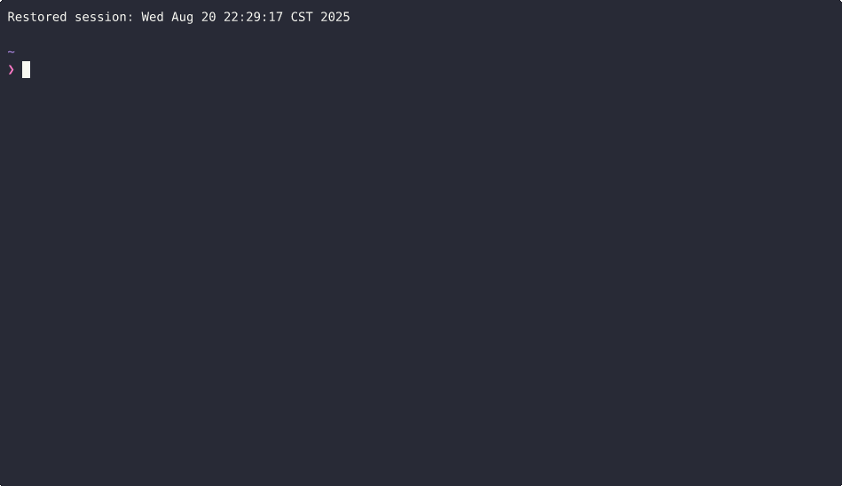

[English](./README.md) | [繁體中文](./README.zh-TW.md) | [简体中文](./README.zh-CN.md)

# LeetSolv

**LeetSolv** 是一個命令列修訂工具，它使用自定義調整的 [SuperMemo 2](https://en.wikipedia.org/wiki/SuperMemo) 演算法。此演算法結合了**熟悉度**、**重要性**、**推理**以及其他因素等變數，旨在通過練習來促進對演算法的掌握——**而不是死記硬背**。

> ***0️⃣ 零依賴哲學**: 完全用純 Go 語言實現，沒有第三方庫、API 或外部工具。甚至避免使用一些標準套件，以便完全控制底層實現——突顯了該專案對基礎知識的關注。有關更多詳細資訊，請參閱 [MOTIVATION.md](document/MOTIVATION.md)*。

**LeetSolv 的工作流程：**

使用 LeetSolv 的建議每日工作流程。




## 目錄
- [LeetSolv](#leetsolv)
  - [目錄](#目錄)
  - [快速安裝](#快速安裝)
    - [自動安裝 (Linux/macOS)](#自動安裝-linuxmacos)
    - [手動下載 (所有平台)](#手動下載-所有平台)
    - [驗證安裝](#驗證安裝)
  - [複習排程系統](#複習排程系統)
    - [自適應 SM-2 演算法](#自適應-sm-2-演算法)
    - [到期優先級評分](#到期優先級評分)
    - [間隔增長曲線](#間隔增長曲線)
  - [問題管理](#問題管理)
    - [CRUD + 復原](#crud--復原)
    - [資料隱私 \& 安全](#資料隱私--安全)
    - [CLI 介面](#cli-介面)
  - [用法](#用法)
    - [互動模式](#互動模式)
    - [命令列模式](#命令列模式)
    - [可用命令](#可用命令)
    - [搜尋命令篩選器](#搜尋命令篩選器)
  - [配置](#配置)
    - [檔案路徑](#檔案路徑)
    - [SM-2 演算法設定](#sm-2-演算法設定)
    - [到期優先級評分設定](#到期優先級評分設定)
    - [其他設定](#其他設定)
    - [範例：環境變數](#範例環境變數)
    - [範例：JSON 設定檔](#範例json-設定檔)
  - [路線圖](#路線圖)
    - [安裝 \& 執行](#安裝--執行)
    - [功能](#功能)
    - [文件](#文件)
  - [許可證](#許可證)
  - [支援](#支援)
    - [常見問題](#常見問題)
      - [問：我應該一次新增所有先前已解決的 LeetCode 問題嗎？](#問我應該一次新增所有先前已解決的-leetcode-問題嗎)
      - [問：如果我想新增一個幾個月前解決的舊問題怎麼辦？](#問如果我想新增一個幾個月前解決的舊問題怎麼辦)
      - [問：使用一段時間後，我累積了太多未完成的問題。](#問使用一段時間後我累積了太多未完成的問題)
    - [文件](#文件-1)
    - [連結](#連結)

## 快速安裝

### 自動安裝 (Linux/macOS)
```bash
# 下載並執行安裝腳本
curl -fsSL https://raw.githubusercontent.com/eannchen/leetsolv/main/install.sh | bash

# 或先下載，然後執行
wget https://raw.githubusercontent.com/eannchen/leetsolv/main/install.sh
chmod +x install.sh
./install.sh
```

### 手動下載 (所有平台)
1. 前往 [Releases](https://github.com/eannchen/leetsolv/releases)
2. 下載適用於您平台的二進位檔案：
   - **Linux**: `leetsolv-linux-amd64` 或 `leetsolv-linux-arm64`
   - **macOS**: `leetsolv-darwin-amd64` 或 `leetsolv-darwin-arm64`
   - **Windows**: `leetsolv-windows-amd64.exe` 或 `leetsolv-windows-arm64.exe`

### 驗證安裝
```bash
leetsolv version
leetsolv help
```

> *有關詳細的安裝和配置說明，請參閱 [INSTALL.md](document/INSTALL.md)*

## 複習排程系統

### 自適應 SM-2 演算法

新增問題時，LeetSolv 會應用具有自定義因素（**熟悉度**、**重要性**和**推理**）的 SM-2 演算法，以使用容易度因子計算下一次複習日期。

- **容易度因子**：用於計算下一次複習間隔的經典 SM-2 演算法決定因素。
- **熟悉度量表**：5 級熟悉度評估（`VeryHard`、`Hard`、`Medium`、`Easy`、`VeryEasy`）用於個人評分。
- **重要性量表**：4 層優先級系統（`Low`、`Medium`、`High`、`Critical`）用於問題優先級排序。
- **推理量表**：3 級記憶評估（`Reasoned`、`Partial`、`Full recall`），對薄弱的推理進行懲罰。此設計強化了通過推理而不是死記硬背來掌握資料結構和演算法的目標。
- **到期懲罰（可選）**：對過期複習問題的自動懲罰系統。
- **隨機化（可選）**：隨機排程變化以防止日期過度擬合。


> *在此處查看以了解有關該演算法的更多資訊：[間隔增長曲線](#interval-growing-curve)*

### 到期優先級評分
使用 SM-2 時，由於用戶有不同的排程和學習習慣，因此到期複習很容易累積。為了應對這一挑戰，LeetSolv 引入了一種到期優先級評分功能，**允許用戶根據優先級分數對到期問題進行優先級排序**。

- **多因素評分**：重要性、熟悉度、過期天數、複習次數和容易度因子的組合決定了到期優先級。


> *預設情況下，優先級分數使用以下公式計算：(1.5×重要性)+(0.5×過期天數)+(3.0×熟悉度)+(-1.5×複習次數)+(-1.0×容易度因子)*

**到期優先級列表演示：**


### 間隔增長曲線

LeetSolv 根據重要性、熟悉度和推理調整 SM-2 間隔。**重要問題會更頻繁地複習，而較容易的問題的間隔會逐漸變長。**

以下圖表展示了不同重要性級別的複習間隔如何隨時間增長，顯示了預設的增長模式：


**重要問題**：最短的間隔，頻繁的複習，以確保掌握最重要的概念。


**高重要性**：適度的間隔，平衡了頻率和效率，適用於重要問題。


**中等重要性**：標準間隔，遵循經典的 SM-2 漸進式練習。


**低重要性**：較長的間隔，適用於不需要頻繁複習的問題。

> *未來的迭代可能會允許直接在配置文件中修改演算法參數。*

## 問題管理

### CRUD + 復原
- **摘要視圖**：總問題、到期問題和即將到來的問題的概述，帶有[優先級評分](#due-priority-scoring)。
- **列表視圖**：列出所有問題，帶有分頁。
- **基於 Trie 的搜尋 \& 篩選**：通過關鍵字、熟悉度、重要性、複習次數和到期狀態進行快速搜尋和篩選。
- **獲取問題詳細資訊**：檢索有關特定問題的詳細資訊。
- **新增/更新問題**：建立或修改帶有 URL 和註釋的問題。
- **移除問題**：按 ID 和 URL 刪除問題。
- **歷史記錄 \& 復原**：追蹤更改並還原最近的操作。


**搜尋、歷史記錄、刪除、復原功能演示：**


### 資料隱私 \& 安全

- **無資料收集**：LeetSolv 不會將用戶資料上傳到網際網路。
- **原子寫入**：所有更新都使用帶有原子替換的臨時檔案，以保證一致性並防止資料丟失。


### CLI 介面
- **互動模式**：用戶和程式之間的輪流對話。
- **批次模式**：直接從命令列執行命令。
- **別名支援**：方便的直觀快捷方式（例如，`ls`、`rm`、`cfg`）。
- **分頁**：用於大型問題集的有效導航。
- **清晰輸出**：結構化的、顏色編碼的 CLI 輸出。

**分頁演示：**


## 用法

### 互動模式
```bash
# 啟動互動式會話
leetsolv

# 你會看到提示：
leetsolv ❯
```

### 命令列模式
```bash
# 列出所有問題
leetsolv list

# 搜尋帶有篩選器的問題
leetsolv search tree --familiarity=3 --importance=2 --due-only

# 獲取問題詳細資訊
leetsolv detail 123

# 檢查狀態
leetsolv status

# 新增新問題
leetsolv add https://leetcode.com/problems/example
```

### 可用命令

| 命令      | 別名                  | 描述                           |
| --------- | --------------------- | ------------------------------ |
| `list`    | `ls`                  | 列出所有問題，帶有分頁         |
| `search`  | `s`                   | 按關鍵字搜尋問題（支援篩選器） |
| `detail`  | `get`                 | 獲取有關問題的詳細資訊         |
| `status`  | `stat`                | 顯示到期和即將到來的問題的摘要 |
| `upsert`  | `add`                 | 新增或更新問題                 |
| `remove`  | `rm`, `delete`, `del` | 刪除問題                       |
| `undo`    | `back`                | 復原上次操作                   |
| `history` | `hist`, `log`         | 顯示操作歷史記錄               |
| `setting` | `config`, `cfg`       | 查看和修改應用程式設定         |
| `version` | `ver`, `v`            | 顯示應用程式版本資訊           |
| `help`    | `h`                   | 顯示說明資訊                   |
| `clear`   | `cls`                 | 清除螢幕                       |
| `quit`    | `q`, `exit`           | 退出應用程式                   |

### 搜尋命令篩選器

`search` 命令允許您按關鍵字（在 **URL** 或 **註釋** 中）搜尋，並使用篩選器優化結果。

**語法：**
```bash
search [keywords...] [filters...]
```

**篩選器：**

| 篩選器             | 描述                   |
| ------------------ | ---------------------- |
| `--familiarity=N`  | 按熟悉度級別篩選 (1-5) |
| `--importance=N`   | 按重要性級別篩選 (1-4) |
| `--review-count=N` | 按複習次數篩選         |
| `--due-only`       | 僅顯示到期問題         |

## 配置

您可以通過兩種方式配置 **LeetSolv**：

1. **環境變數** – 方便用於臨時或部署級別的覆蓋。
2. **JSON 設定檔** (`$HOME/.leetsolv/settings.json`) – 您可以手動編輯的持久配置。

這兩種方法都映射到相同的內部配置。
- 環境變數遵循 `UPPERCASE_SNAKE_CASE` 命名。
- JSON 欄位遵循 `camelCase` 命名。

例如：
- 環境變數：`LEETSOLV_RANDOMIZE_INTERVAL=true`
- JSON：`"randomizeInterval": true`

如果同時提供這兩種方法，則 **JSON 設定檔優先**於環境變數。

### 檔案路徑

| 環境變數                  | JSON 欄位       | 預設值                           | 描述             |
| ------------------------- | --------------- | -------------------------------- | ---------------- |
| `LEETSOLV_QUESTIONS_FILE` | `questionsFile` | `$HOME/.leetsolv/questions.json` | 問題資料檔案     |
| `LEETSOLV_DELTAS_FILE`    | `deltasFile`    | `$HOME/.leetsolv/deltas.json`    | 變更歷史記錄檔案 |
| `LEETSOLV_INFO_LOG_FILE`  | `infoLogFile`   | `$HOME/.leetsolv/info.log`       | 資訊日誌檔案     |
| `LEETSOLV_ERROR_LOG_FILE` | `errorLogFile`  | `$HOME/.leetsolv/error.log`      | 錯誤日誌檔案     |
| `LEETSOLV_SETTINGS_FILE`  | `settingsFile`  | `$HOME/.leetsolv/settings.json`  | 配置 JSON 檔案   |

### SM-2 演算法設定

| 環境變數                      | JSON 欄位           | 預設值  | 描述                   |
| ----------------------------- | ------------------- | ------- | ---------------------- |
| `LEETSOLV_RANDOMIZE_INTERVAL` | `randomizeInterval` | `true`  | 啟用/停用間隔隨機化    |
| `LEETSOLV_OVERDUE_PENALTY`    | `overduePenalty`    | `false` | 啟用/停用到期懲罰系統  |
| `LEETSOLV_OVERDUE_LIMIT`      | `overdueLimit`      | `7`     | 過期問題受到懲罰的天數 |

### 到期優先級評分設定

| 環境變數                         | JSON 欄位             | 預設值 | 描述                          |
| -------------------------------- | --------------------- | ------ | ----------------------------- |
| `LEETSOLV_TOP_K_DUE`             | `topKDue`             | `10`   | 要顯示的前 K 個到期問題       |
| `LEETSOLV_TOP_K_UPCOMING`        | `topKUpcoming`        | `10`   | 要顯示的前 K 個即將到來的問題 |
| `LEETSOLV_IMPORTANCE_WEIGHT`     | `importanceWeight`    | `1.5`  | 問題重要性的權重              |
| `LEETSOLV_OVERDUE_WEIGHT`        | `overdueWeight`       | `0.5`  | 過期問題的權重                |
| `LEETSOLV_FAMILIARITY_WEIGHT`    | `familiarityWeight`   | `3.0`  | 熟悉度級別的權重              |
| `LEETSOLV_REVIEW_PENALTY_WEIGHT` | `reviewPenaltyWeight` | `-1.5` | 高複習次數的懲罰              |
| `LEETSOLV_EASE_PENALTY_WEIGHT`   | `easePenaltyWeight`   | `-1.0` | 容易問題的懲罰                |

### 其他設定

| 環境變數             | JSON 欄位  | 預設值 | 描述               |
| -------------------- | ---------- | ------ | ------------------ |
| `LEETSOLV_PAGE_SIZE` | `pageSize` | `5`    | 每頁問題數         |
| `LEETSOLV_MAX_DELTA` | `maxDelta` | `50`   | 最大歷史記錄條目數 |

### 範例：環境變數

```bash
export LEETSOLV_RANDOMIZE_INTERVAL=false
export LEETSOLV_PAGE_SIZE=20
```

### 範例：JSON 設定檔

```json
{
    "randomizeInterval": false,
    "pageSize": 20
}
```

## 路線圖

### 安裝 \& 執行

- 支援通過套件管理器（Homebrew、Chocolatey、apt）安裝
- 支援作為 Docker 容器執行
- 支援自動更新程式功能
- 新增 Windows 安裝腳本

### 功能

- 提供標記功能
- 提供匯出功能
- 新增對來自其他平台的 DSA 問題的支援
- 使 SM-2 演算法可由用戶自定義
- 實作模糊搜尋功能

### 文件

- 編寫多語言文件

## 許可證

本專案已根據 [LICENSE](LICENSE) 檔案中指定的條款獲得許可。

## 支援

### 常見問題

#### 問：我應該一次新增所有先前已解決的 LeetCode 問題嗎？

答：**否。** LeetSolv 的排程演算法依賴於您新增問題的日期來計算未來的複習。在同一天新增所有問題會使排程不準確，並且可能會在幾天後導致大量無法管理的複習。

#### 問：如果我想新增一個幾個月前解決的舊問題怎麼辦？

答：最好的方法是先重新解決該問題。再次成功解決該問題後，請使用 `leetsolv add` 在當天將其新增到 LeetSolv。這可確保系統具有準確的「上次查看」日期以供使用。

#### 問：使用一段時間後，我累積了太多未完成的問題。

答：這是 **SM-2 演算法** 的本質 — 如果你跳過幾天或一次新增許多問題，未完成的列表可能會迅速增長。
為了使其易於管理，LeetSolv 引入了 **[到期優先級評分](#due-priority-scoring)**，該評分會根據重要性、熟悉度、逾期天數、複習次數和難易度對到期問題進行排名。
不要一次清除所有內容，只需專注於**最高優先級的問題**即可。 其餘的可以安全地等到以後。

👉 提示：僅新增您實際想要重新複習的問題。 當您有選擇性時，LeetSolv 的效果最佳，而不是批量新增所有內容。

### 文件
- **[INSTALL.md](document/INSTALL.md)**：完整的安裝指南，包含疑難排解
- **[DEVELOPMENT_GUIDE.md](document/DEVELOPMENT_GUIDE.md)**：開發工作流程、CI/CD 和貢獻指南
- **[MOTIVATION.md](document/MOTIVATION.md)**：專案動機和設計說明
- **本 README**：專案概述和快速入門

### 連結
- **問題**：[GitHub Issues](https://github.com/eannchen/leetsolv/issues)
- **討論**：[GitHub Discussions](https://github.com/eannchen/leetsolv/discussions)
- **版本**：[GitHub Releases](https://github.com/eannchen/leetsolv/releases)

---

**LeetSolv** - 一個 CLI 修訂工具，它使用自定義調整的 SM-2 演算法，專為通過實踐來掌握演算法而構建——而不是死記硬背。
